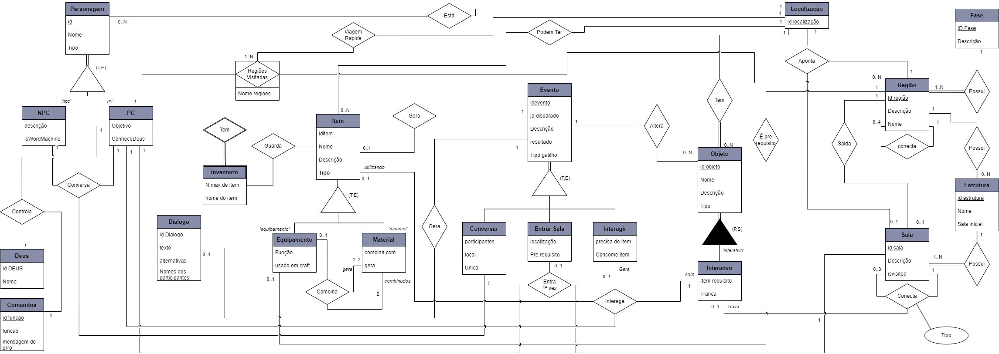

# <a>Modelo Conceitual</a>

## <a>Introdução</a>
O modelo conceitual é uma representação abstrata dos objetos e suas relações em um domínio de negócios. Ele é composto por entidades, atributos e relacionamentos. 

As entidades representam objetos no domínio de negócios, como clientes, produtos, pedidos, etc. Os atributos são as características que descrevem as entidades. Os relacionamentos representam as associações entre as entidades.

## <a>Descrição Conceitual</a>
A descrição conceitual é uma etapa importante da modelagem de dados que envolve a análise dos elementos e fenômenos relevantes de uma realidade observada ou imaginada e a posterior formação de um modelo abstrato do corpo de conhecimento adquirido. 

O modelo conceitual concentra-se no mais alto nível de abstração e não leva em conta o banco de dados em si, mas a forma como as estruturas serão criadas para armazenar os dados.

### <a>Entidades e Atributos</a>
- **Entidade 1**
    - Atributo 1
    - Atributo 2
- **Entidade 2**
    - Atributo 1
    - Atributo 2

### <a>Relacionamentos</a>
- Relacionamento entre Entidade 1 e Entidade 2

## <a>Modelo Entidade Relacionamento</a>
O modelo Entidade-Relacionamento (ER) é um modelo conceitual utilizado na Engenharia de Software para descrever objetos envolvidos no domínio de um sistema de bancos de dados a ser construído, incluindo seus atributos e relacionamentos. 

### <a>Diagrama</a>
O diagrama Entidade-Relacionamento (ER) é uma representação gráfica do modelo ER. Ele é composto por entidades, relacionamentos e atributos. As entidades são representadas por retângulos, os atributos são representados por como linhas do retangulo e os relacionamentos são representados por losangos.

Clique [aqui](../../images/modelagem/DER-1.0.png) para ver a imagem em tela cheia. 
Ou clique [aqui](../../arquivos/DER-2.0.drawio) para baixar o arquivo do draw.io.

## <a>Histórico de Versão</a>
|   Data   | Versão |      Descrição       |                   Autor                    |
| :------: | :----: | :------------------: | :----------------------------------------: |
| 25/11/23 |  1.0   | Criação do documento | [João Lucas](https://github.com/HacKairos) |

## <a>Bilbiografia</a>
    AVI SILBERSCHATZ, HENRY F. KORTH, S. SUDARSHAN. Database System Concepts. [s.l: s.n.].
    CHEN, Peter. Entity-relationship modeling. 1st ed. New York: ACM Press, 1976. 176 p.