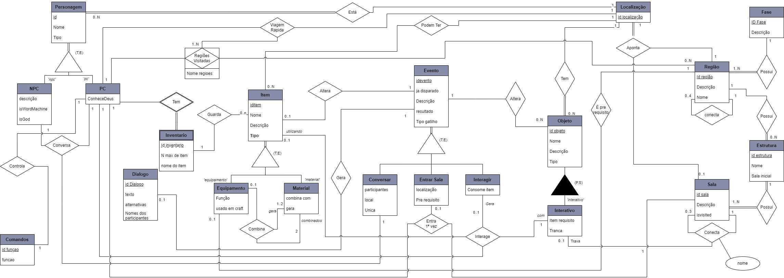

# <a>Modelo Conceitual</a>

## <a>Introdução</a>
O modelo conceitual é uma representação abstrata dos objetos e suas relações em um domínio de negócios. Ele é composto por entidades, atributos e relacionamentos. 

As entidades representam objetos no domínio de negócios, como clientes, produtos, pedidos, etc. Os atributos são as características que descrevem as entidades. Os relacionamentos representam as associações entre as entidades.

## <a>Descrição Conceitual</a>
A descrição conceitual é uma etapa importante da modelagem de dados que envolve a análise dos elementos e fenômenos relevantes de uma realidade observada ou imaginada e a posterior formação de um modelo abstrato do corpo de conhecimento adquirido. 

O modelo conceitual concentra-se no mais alto nível de abstração e não leva em conta o banco de dados em si, mas a forma como as estruturas serão criadas para armazenar os dados.

### <a>Entidades e Atributos</a>

<strong>Entidades e Atributos</strong>

<a><strong>Personagem</strong></a>
    <li>id</li>
    <li>Nome</li>
    <li>Tipo</li>
<a><strong>Personagem NPC</strong></a>
    <li>Descrição</li>
    <li>IsWorldMachine</li>
<a><strong>Personagem PC</strong></a>
    <li>Objetivo</li>
    <li>ConhceceDeus</li>
<a><strong>Deus</strong></a>
    <li>id Deus</li>
    <li>Nome</li>
<a><strong>Comandos</strong></a>
    <li>id função    </li>
    <li>função</li>
    <li>mensagem de erro</li>
<a><strong>Inventario</strong></a>
    <li>N max de item</li>
    <li>nome do item</li>
<a><strong>Itens</strong></a>
    <li>id Item</li>
    <li>Nome</li>
    <li>Descrição</li>
    <li>Tipo</li>
<a><strong>Itens Equipamento</strong></a>
    <li>Função</li>
    <li>usado em craft</li>
<a><strong>Itens Item</strong></a>
    <li>Combina com</li>
    <li>Gera</li>
<a><strong>Dialogo</strong></a>
    <li>Id Dialogo</li>
    <li>Texto</li>
    <li>Alternativas</li>
    <li>Nome dos participantes</li>
<a><strong>Objeto</strong></a>
    <li>Id Objeto</li>
    <li>Nome</li>
    <li>Descrição</li>
    <li>Tipo</li>
<a><strong>Objeto Interativo</strong></a>
    <li>Item requisito</li>
    <li>Tranca</li>
<a><strong>Evento</strong></a>
    <li>id evento</li>
    <li>já disparado</li>
    <li>Descrição</li>
    <li>Resultado</li>
    <li>Tipo Gatilho</li>
<a><strong>Evento Conversar</strong></a>
    <li>Participantes</li>
    <li>Local</li>
    <li>unica</li>
<a><strong>Evento Entrar Sala</strong></a>
    <li>localização</li>
    <li>Pre requisito</li>
<a><strong>Evento Interagir</strong></a>
    <li>precisa de item</li>
    <li>Consome item</li>
<a><strong>Localização</strong></a>
    <li>id localização</li>
<a><strong>Fase</strong></a>
    <li>id Fase</li>
    <li>Descrição</li>
<a><strong>Região</strong></a>
    <li>id Região</li>
    <li>descrição</li>
    <li>nome</li>
<a><strong>Estrutura</strong></a>
    <li>id estrutura</li>
    <li>nome</li>
    <li>sala inicial</li>
<a><strong>Sala</strong></a>
    <li>id sala</li>
    <li>descrição</li>
    <li>is visited</li>
<a><strong>Regiões Visitadas</strong></a>
    <li>nome das regiões</li> 

### <a>Relacionamentos</a>

<strong>Relacionamentos</strong>

<a><strong>Personagem está em localização</strong></a>
    <li>Todo Personagem está em uma localização (1,1)</li>
    <li>Toda Localização pode possuir um ou mais Personagems (O,N)</li>
<a><strong>Deus Controla Personagem PC com Comando</strong></a>
    <li>Deus Controla um Personagem PC com um Comando (1,1)</li>
    <li>O Personagem PC é controlado por um comando de Deus (1,1)</li>
    <li>Comando feito por Deus Controla Personagem PC (0,1)</li>
<a><strong>Regiões visitadas são geradas quando o Personagem PC visita outra região</strong></a>
    <li>Um Personagem PC ao visitar uma regão adiciona a mesma na lista de Regiões visitadas (1,1)</li>
    <li>Uma Região visitada por um Personagem PC entra para lista de Regiões visitadas (1,1)</li>
<a><strong>Personagem PC viaja rapidamente para Localização de regiões ja visitadas</strong></a>
    <li>Um Personagem PC pode viajar rapidamente para uma localização que aponta para uma Região visitada (1,1)</li>
    <li>Um localização pode ser alvo da viagem rapida do Personagem PC se a mesma apontar para uma Região visitada  (0,1)</li>
    <li>Uma região visitada pode ser o destino da viagem rapida que altera a localização do Personagem PC (0,1)</li>
<a><strong>Personagem PC Tem Inventario</a></strong>
    <li>Um Personagem PC Possui um Inventario (1,1)</li>
    <li>um Invetario é possuido por um Personagem PC (1,1)</li>
<a><strong>Inventario guarda Item</a></strong>
    <li>Um inventario Guarda 0 ou mais itens (0,N)</li>
    <li>Um item pode estar guardado no inventario (0,1)</li>
<a><strong>Item Pode Ter Localização</a></strong>
    <li>Um item pode pode ter uma ou nenhuma localização(0,1)</li>
    <li>Uma localização pode ter 0 ou varios Items (0,N)</li>
<a><strong>Item Equipamento pode ser pré requisito de região</a></strong>
    <li>Um Item Equipamento pode ser necessario para entrar em uma região (0,1)</li>
    <li>Uma região pode ter um item pré requisito para ser visitada (0,1)</li>
<a><strong>Itens Material combinados usando ou não um equipamento geram Itens Material</a></strong>
    <li>Dois item Material combinam podendo ser necessario um equipamento para gerar um ou dois Item Material (2,2)</li>
    <li>Um ou Dois Item Material são gerados ao combinar 2 Item Material usando ou não um equipamento (1,2)</li>
    <li>Pode ser necessario um equipamento para combinar 2 Item Material (0,1)</li>
<a><strong>Objeto Tem Localização</a></strong>
    <li>Todo objeto tem uma localização (1,1)</li>
    <li>Uma localização pode ter 0 ou mais Objetos (0,N)</li>
<a><strong>Fase possui Região</a></strong>
    <li>Toda fase possui pelo menos uma região (1,N)</li>
    <li>Toda região está em uma fase (1,1)</li>
<a><strong>Região possui Estrutura</a></strong>
    <li>Uma região possui 0 ou mais estruturas (0,N)</li>
    <li>Toda estrutura está em Região (1,1)</li>
<a><strong>Estrutura possui Sala</a></strong>
    <li>Toda estrutura possui uma sala ou mais (1,N)</li>
    <li>Toda sala está em uma estrutura (1,1)</li>
<a><strong>Sala está conectada a sala e pode estar travada por objeto</a></strong>
    <li>Uma sala pode ter de 0 a 3 conexões e as conexões podem estar travadas por objetos (1,1)</li>
    <li>Uma conexão conecta ate 3 outras salas que podem estar travadas por objetos (0,3)</li>
    <li>Objetos podem travar conexões entre as salas (0,1)</li>
<a><strong>Localização aponta para Região e/ou Sala</a></strong>
    <li>Uma localização aponta para 1 região e pode apontar para uma sala (1,1)</li>
    <li>Uma região é apontada pela localização (1,1)</li>
    <li>Uma sala pode estar apontada na localização alem da região (0,1)</li>
<a><strong>Evento Altera Objeto</a></strong>
    <li>Um evento pode alterar um Objeto (1,1)</li>
    <li>Um ou mais Objetos podem ser alterados por um Evento (0,N)</li>
<a><strong>Evento Gera Item</a></strong>
    <li>Um evento pode gerar um Item (1,1)</li>
    <li>Até um Item pode ser gerado por um evento (0,1)</li>
<a><strong>Evento Gera Dialogo</a></strong>
    <li>Um evento pode gerar um Dialogo (1,1)</li>
    <li>Até um Dialogo pode ser gerado por um evento (0,1)</li>
<a><strong>Personagem PC entrar 1ª vez em Sala gera Evento Entrar Sala</a></strong>
    <li>Um Personagem PC entrar ao entar pela 1ª vez em uma sala pode disparar um Evento Entrar Sala (1,1)</li>
    <li>Uma sala ao ser visitada pela primeira vez pelo Personagem PC pode disparar um Evento Entrar Sala (1,1)</li>
    <li>Um Evento Entrar Sala pode ser gerado quando um Personagem PC entra em uma Sala pela 1ª vez (0,1)</li>
<a><strong>Personagem Pc conversa com Personagem NPC e gera Evento Conversar</a></strong>
        <li>Um Personagem PC conversa com um personagem NPC e gera um Evento Conversar (1,1)</li>
        <li>Um Personagem NPC conversa com um personagem PC e gera um Evento Conversar (1,1)</li>
        <li>Um Evento Conversar é gerado sempre que um Personagem PC conversa com um Personagem NPC (1,1)</li>
<a><strong>Personagem PC Interage com Objeto Interativo usando ou não Item Material e pode gerar um Evento Interagir</a></strong>
    <li>Um Personagem PC Interagem com um objeto usando ou não um Item Material e pode gerar um Evento Interagir (1,1)</li>
    <li>Um Objeto Interativo pode ser interagido por um Personagem PC utilizando ou não um Item Material e pode gerar um Evento Interagir (0,1)</li>
    <li>Um Item Material Pode ser utilizado na interação entre um Objeto Interativo e um Objeto Interativo e pode gerar um Evento Interagir (0,1)</li>
    <li>Um Evento Interagir é gerado sempre que um Personagem Pc Interage com um Objeto Interativo usando ou não um Item Material (1,1)</li>

## <a>Modelo Entidade Relacionamento</a>
O modelo Entidade-Relacionamento (ER) é um modelo conceitual utilizado na Engenharia de Software para descrever objetos envolvidos no domínio de um sistema de bancos de dados a ser construído, incluindo seus atributos e relacionamentos. 

### <a>Diagrama Entidade Relacionamento</a>
O diagrama Entidade-Relacionamento (ER) é uma representação gráfica do modelo ER. Ele é composto por entidades, relacionamentos e atributos. As entidades são representadas por retângulos, os atributos são representados por como linhas do retangulo e os relacionamentos são representados por losangos.Na figura a seguir está representado o diagrama do projeto

 

**Figura 1** : Diagrama Entidade Relacionamento

 

Clique [aqui](../../images/modelagem/DER-1.0.png) para ver a imagem em tela cheia. 
Ou clique [aqui](../../arquivos/DER-1.0.drawio) para baixar o arquivo do draw.io.

## <a>Histórico de Versão</a>
|   Data   | Versão |      Descrição       |                   Autor                    |
| :------: | :----: | :------------------: | :----------------------------------------: |
| 25/11/23 |  1.0   | Criação do documento | [João Lucas](https://github.com/HacKairos) |

## <a>Bilbiografia</a>
    AVI SILBERSCHATZ, HENRY F. KORTH, S. SUDARSHAN. Database System Concepts. [s.l: s.n.].
    CHEN, Peter. Entity-relationship modeling. 1st ed. New York: ACM Press, 1976. 176 p.