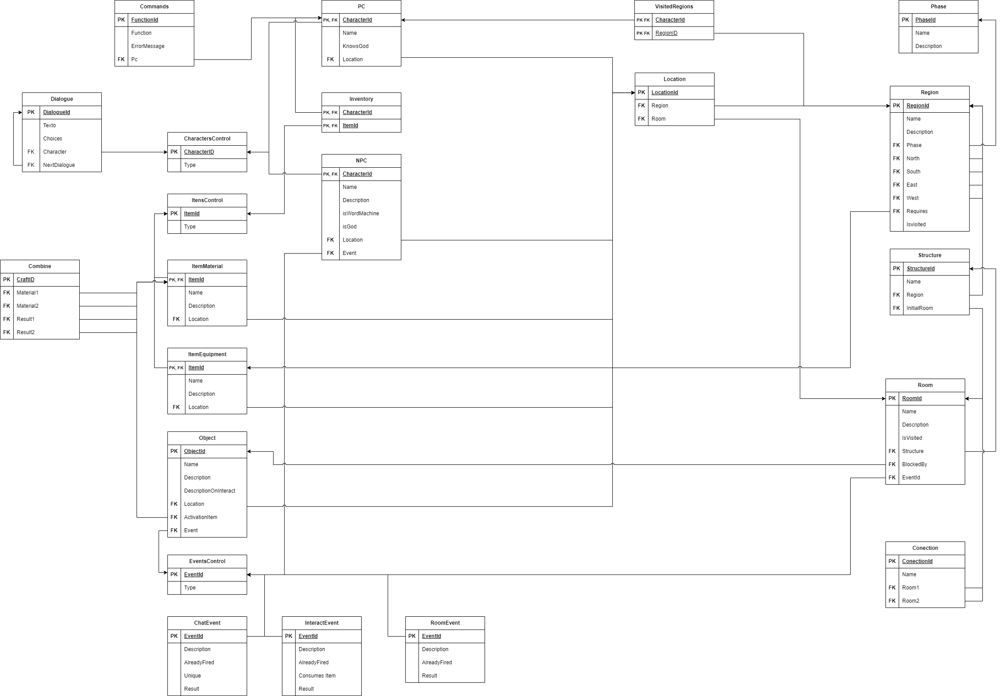

# <a>Modelo Lógico</a>

## <a>Introdução</a>
O modelo lógico é uma representação abstrata de um banco de dados que descreve a estrutura dos dados e as relações entre eles. Ele é independente do banco de dados físico que detalha como os dados serão implementados. 

O modelo lógico serve como um modelo para os dados usados e leva os elementos de modelagem de dados conceituais um passo adiante, adicionando mais informações a eles. 

O modelo lógico incorpora todos os elementos de informação que são vitais para o funcionamento do dia a dia dos negócios. Um projeto lógico é a implementação do modelo lógico em um banco de dados real. 

Ele descreve como os dados serão armazenados e organizados em tabelas, colunas e chaves primárias e estrangeiras. O projeto lógico é baseado no modelo lógico e é usado para criar um banco de dados físico que possa ser usado para armazenar e recuperar dados

## <a>Modelo Relacional</a>
O modelo relacional usa uma coleção de tabelas para representar tanto os dados quanto as relações entre esses dados. Cada tabela tem várias colunas, e cada coluna tem um nome exclusivo. As tabelas também são conhecidas como relações. 

O modelo relacional é um exemplo de modelo baseado em registro. Os modelos baseados em registro são assim chamados porque o banco de dados é estruturado em registros de vários tipos com formato fixo. 

Cada tabela contém registros de um tipo específico. Cada tipo de registro define um número fixo de campos ou atributos. As colunas da tabela correspondem aos atributos do tipo de registro. O modelo de dados relacional é o modelo de dados mais amplamente utilizado, e a grande maioria dos sistemas de banco de dados atuais é baseada no modelo relacional. ¹

### <a>Dependências Funcionais</a>
As dependências funcionais são uma parte importante do modelo relacional. Uma dependência funcional é uma relação entre dois atributos de uma tabela, onde um atributo determina o valor de outro. Em outras palavras, se o valor de um atributo A determina o valor de um atributo B, então dizemos que B é funcionalmente dependente de A.

 As dependências funcionais são usadas para garantir que os dados em uma tabela sejam consistentes e precisos. Elas também são usadas para ajudar a normalizar as tabelas, o que pode melhorar o desempenho do banco de dados e reduzir a redundância de dados.

### <a>Normalização</a>
A normalização é um processo importante na modelagem relacional. Ela é usada para garantir que os dados em uma tabela sejam consistentes e precisos, além de ajudar a reduzir a redundância de dados e melhorar o desempenho do banco de dados. 

A normalização é baseada em dependências funcionais, que são relações entre dois atributos de uma tabela, onde um atributo determina o valor de outro. A normalização é dividida em várias formas normais, cada uma com um conjunto de regras que devem ser seguidas para garantir que a tabela esteja normalizada. 

As formas normais mais comuns são a primeira forma normal (1NF), a segunda forma normal (2NF) e a terceira forma normal (3NF). Há também as formas normais mais avançadas como a quarta forma normal (4NF) e a forma normal de Boyce-Codd (FNBC). Cada forma normal tem um conjunto de regras que devem ser seguidas para garantir que a tabela esteja normalizada. 

### <a>Dicionario de Dados</a>
O dicionário de dados é uma ferramenta importante na modelagem de banco de dados relacionais. Ele contém informações detalhadas sobre as tabelas, colunas, tipos de dados, restrições e outras informações relevantes para o banco de dados. 

O dicionário de dados é usado para documentar o modelo de dados e garantir que todos os desenvolvedores e usuários do banco de dados tenham uma compreensão clara dos dados armazenados e como eles são organizados. Ele também pode ser usado para ajudar a garantir a integridade dos dados e a consistência do modelo de dados.

<strong>Dicionario de Dados</strong>

<table>
    <tr>
        <th style="text-align:center;vertical-align: middle; border: 1px solid #a3a3a3;">Tabela</th>
        <td style="text-align:center;vertical-align: middle; border: 1px solid #a3a3a3;" colspan="4">Phase</td>
    </tr>
    <tr>
        <th style="text-align:center;vertical-align: middle; border: 1px solid #a3a3a3;">Nome</th>
        <th style="text-align:center;vertical-align: middle; border: 1px solid #a3a3a3;">Descrição</th>
        <th style="text-align:center;vertical-align: middle; border: 1px solid #a3a3a3;">Tipo de Dado</th>
        <th style="text-align:center;vertical-align: middle; border: 1px solid #a3a3a3;">Tamanho</th>
        <th style="text-align:center;vertical-align: middle; border: 1px solid #a3a3a3;">Restrições de Dominio</th>
    </tr>
    <tr>
        <td style="text-align:center;vertical-align: middle; border: 1px solid #a3a3a3;">PhaseId</td>
        <td style="text-align:center;vertical-align: middle; border: 1px solid #a3a3a3;">Identificador unico da fase</td>
        <td style="text-align:center;vertical-align: middle; border: 1px solid #a3a3a3;">Serial</td>
        <td style="text-align:center;vertical-align: middle; border: 1px solid #a3a3a3;"></td>
        <td style="text-align:center;vertical-align: middle; border: 1px solid #a3a3a3;">PK</td>
    </tr>
    <tr>
        <td style="text-align:center;vertical-align: middle; border: 1px solid #a3a3a3;">Name</td>
        <td style="text-align:center;vertical-align: middle; border: 1px solid #a3a3a3;">Nome da fase</td>
        <td style="text-align:center;vertical-align: middle; border: 1px solid #a3a3a3;">Varchar</td>
        <td style="text-align:center;vertical-align: middle; border: 1px solid #a3a3a3;">20</td>
        <td style="text-align:center;vertical-align: middle; border: 1px solid #a3a3a3;">Unique / Not Null</td>
    </tr>
    <tr>
        <td style="text-align:center;vertical-align: middle; border: 1px solid #a3a3a3;">Description</td>
        <td style="text-align:center;vertical-align: middle; border: 1px solid #a3a3a3;">Descrição da fase</td>
        <td style="text-align:center;vertical-align: middle; border: 1px solid #a3a3a3;">Varchar</td>
        <td style="text-align:center;vertical-align: middle; border: 1px solid #a3a3a3;">250</td>
        <td style="text-align:center;vertical-align: middle; border: 1px solid #a3a3a3;">Not Null</td>
    </tr>
</table>
<table>
    <tr>
        <th style="text-align:center;vertical-align: middle; border: 1px solid #a3a3a3;">Tabela</th>
        <td style="text-align:center;vertical-align: middle; border: 1px solid #a3a3a3;" colspan="4">Region</td>
    </tr>
    <tr>
        <th style="text-align:center;vertical-align: middle; border: 1px solid #a3a3a3;">Nome</th>
        <th style="text-align:center;vertical-align: middle; border: 1px solid #a3a3a3;">Descrição</th>
        <th style="text-align:center;vertical-align: middle; border: 1px solid #a3a3a3;">Tipo de Dado</th>
        <th style="text-align:center;vertical-align: middle; border: 1px solid #a3a3a3;">Tamanho</th>
        <th style="text-align:center;vertical-align: middle; border: 1px solid #a3a3a3;">Restrições de Dominio</th>
    </tr>
    <tr>
        <td style="text-align:center;vertical-align: middle; border: 1px solid #a3a3a3;">RegionId</td>
        <td style="text-align:center;vertical-align: middle; border: 1px solid #a3a3a3;">Identificador unico da região</td>
        <td style="text-align:center;vertical-align: middle; border: 1px solid #a3a3a3;">Serial</td>
        <td style="text-align:center;vertical-align: middle; border: 1px solid #a3a3a3;"></td>
        <td style="text-align:center;vertical-align: middle; border: 1px solid #a3a3a3;">PK</td>
    </tr>
    <tr>
        <td style="text-align:center;vertical-align: middle; border: 1px solid #a3a3a3;">Name</td>
        <td style="text-align:center;vertical-align: middle; border: 1px solid #a3a3a3;">Nome da região</td>
        <td style="text-align:center;vertical-align: middle; border: 1px solid #a3a3a3;">Varchar</td>
        <td style="text-align:center;vertical-align: middle; border: 1px solid #a3a3a3;">20</td>
        <td style="text-align:center;vertical-align: middle; border: 1px solid #a3a3a3;">Unique / Not Null</td>
    </tr>
    <tr>
        <td style="text-align:center;vertical-align: middle; border: 1px solid #a3a3a3;">Description</td>
        <td style="text-align:center;vertical-align: middle; border: 1px solid #a3a3a3;">Descrição da região</td>
        <td style="text-align:center;vertical-align: middle; border: 1px solid #a3a3a3;">Varchar</td>
        <td style="text-align:center;vertical-align: middle; border: 1px solid #a3a3a3;">250</td>
        <td style="text-align:center;vertical-align: middle; border: 1px solid #a3a3a3;">Not Null</td>
    </tr>
    <tr>
        <td style="text-align:center;vertical-align: middle; border: 1px solid #a3a3a3;">Phase</td>
        <td style="text-align:center;vertical-align: middle; border: 1px solid #a3a3a3;">Chave estrangeira para  fase que a região Pertence</td>
        <td style="text-align:center;vertical-align: middle; border: 1px solid #a3a3a3;">Int</td>
        <td style="text-align:center;vertical-align: middle; border: 1px solid #a3a3a3;"></td>
        <td style="text-align:center;vertical-align: middle; border: 1px solid #a3a3a3;">FK / Not Null</td>
    </tr>
    <tr>
        <td style="text-align:center;vertical-align: middle; border: 1px solid #a3a3a3;">Requirement</td>
        <td style="text-align:center;vertical-align: middle; border: 1px solid #a3a3a3;">Chave estrangeira para  Equipment que representa um item  necessario para entrar na regiao</td>
        <td style="text-align:center;vertical-align: middle; border: 1px solid #a3a3a3;">Int</td>
        <td style="text-align:center;vertical-align: middle; border: 1px solid #a3a3a3;"></td>
        <td style="text-align:center;vertical-align: middle; border: 1px solid #a3a3a3;">FK</td>
    </tr>
    <tr>
        <td style="text-align:center;vertical-align: middle; border: 1px solid #a3a3a3;">IsVisited</td>
        <td style="text-align:center;vertical-align: middle; border: 1px solid #a3a3a3;">Marcador de região nunca visitada</td>
        <td style="text-align:center;vertical-align: middle; border: 1px solid #a3a3a3;">Boolean</td>
        <td style="text-align:center;vertical-align: middle; border: 1px solid #a3a3a3;"></td>
        <td style="text-align:center;vertical-align: middle; border: 1px solid #a3a3a3;">Default FALSE</td>
    </tr>
</table>
<table>
    <tr>
        <th style="text-align:center;vertical-align: middle; border: 1px solid #a3a3a3;">Tabela</th>
        <td style="text-align:center;vertical-align: middle; border: 1px solid #a3a3a3;" colspan="4">RegionGeo</td>
    </tr>
    <tr>
        <th style="text-align:center;vertical-align: middle; border: 1px solid #a3a3a3;">Nome</th>
        <th style="text-align:center;vertical-align: middle; border: 1px solid #a3a3a3;">Descrição</th>
        <th style="text-align:center;vertical-align: middle; border: 1px solid #a3a3a3;">Tipo de Dado</th>
        <th style="text-align:center;vertical-align: middle; border: 1px solid #a3a3a3;">Tamanho</th>
        <th style="text-align:center;vertical-align: middle; border: 1px solid #a3a3a3;">Restrições de Dominio</th>
    </tr>
    <tr>
        <td style="text-align:center;vertical-align: middle; border: 1px solid #a3a3a3;">RegionId</td>
        <td style="text-align:center;vertical-align: middle; border: 1px solid #a3a3a3;">Chave estrangeira para regiao e Identificador unico de RegionGeo</td>
        <td style="text-align:center;vertical-align: middle; border: 1px solid #a3a3a3;">Int</td>
        <td style="text-align:center;vertical-align: middle; border: 1px solid #a3a3a3;"></td>
        <td style="text-align:center;vertical-align: middle; border: 1px solid #a3a3a3;">PK / FK</td>
    </tr>
    <tr>
        <td style="text-align:center;vertical-align: middle; border: 1px solid #a3a3a3;">North</td>
        <td style="text-align:center;vertical-align: middle; border: 1px solid #a3a3a3;">Chave estrangeira referenciando  o id da região que intentifica a região Norte</td>
        <td style="text-align:center;vertical-align: middle; border: 1px solid #a3a3a3;">Int</td>
        <td style="text-align:center;vertical-align: middle; border: 1px solid #a3a3a3;"></td>
        <td style="text-align:center;vertical-align: middle; border: 1px solid #a3a3a3;">FK</td>
    </tr>
    <tr>
        <td style="text-align:center;vertical-align: middle; border: 1px solid #a3a3a3;">South</td>
        <td style="text-align:center;vertical-align: middle; border: 1px solid #a3a3a3;">Chave estrangeira referenciando  o id da região que intentifica a região Sul</td>
        <td style="text-align:center;vertical-align: middle; border: 1px solid #a3a3a3;">Int</td>
        <td style="text-align:center;vertical-align: middle; border: 1px solid #a3a3a3;"></td>
        <td style="text-align:center;vertical-align: middle; border: 1px solid #a3a3a3;">FK</td>
    </tr>
    <tr>
        <td style="text-align:center;vertical-align: middle; border: 1px solid #a3a3a3;">East</td>
        <td style="text-align:center;vertical-align: middle; border: 1px solid #a3a3a3;">Chave estrangeira referenciando  o id da região que intentifica a região Leste</td>
        <td style="text-align:center;vertical-align: middle; border: 1px solid #a3a3a3;">Int</td>
        <td style="text-align:center;vertical-align: middle; border: 1px solid #a3a3a3;"></td>
        <td style="text-align:center;vertical-align: middle; border: 1px solid #a3a3a3;">FK</td>
    </tr>
    <tr>
        <td style="text-align:center;vertical-align: middle; border: 1px solid #a3a3a3;">West</td>
        <td style="text-align:center;vertical-align: middle; border: 1px solid #a3a3a3;">Chave estrangeira referenciando  o id da região que intentifica a região Oeste</td>
        <td style="text-align:center;vertical-align: middle; border: 1px solid #a3a3a3;">Int</td>
        <td style="text-align:center;vertical-align: middle; border: 1px solid #a3a3a3;"></td>
        <td style="text-align:center;vertical-align: middle; border: 1px solid #a3a3a3;">FK</td>
    </tr>
</table>
<table>
    <tr>
        <th style="text-align:center;vertical-align: middle; border: 1px solid #a3a3a3;">Tabela</th>
        <td style="text-align:center;vertical-align: middle; border: 1px solid #a3a3a3;" colspan="4">VisitedRegions</td>
    </tr>
    <tr>
        <th style="text-align:center;vertical-align: middle; border: 1px solid #a3a3a3;">Nome</th>
        <th style="text-align:center;vertical-align: middle; border: 1px solid #a3a3a3;">Descrição</th>
        <th style="text-align:center;vertical-align: middle; border: 1px solid #a3a3a3;">Tipo de Dado</th>
        <th style="text-align:center;vertical-align: middle; border: 1px solid #a3a3a3;">Tamanho</th>
        <th style="text-align:center;vertical-align: middle; border: 1px solid #a3a3a3;">Restrições de Dominio</th>
    </tr>
    <tr>
        <td style="text-align:center;vertical-align: middle; border: 1px solid #a3a3a3;">CharacterId</td>
        <td style="text-align:center;vertical-align: middle; border: 1px solid #a3a3a3;">Id do PC que visitou  determinadas regiôes</td>
        <td style="text-align:center;vertical-align: middle; border: 1px solid #a3a3a3;">Int</td>
        <td style="text-align:center;vertical-align: middle; border: 1px solid #a3a3a3;"></td>
        <td style="text-align:center;vertical-align: middle; border: 1px solid #a3a3a3;">PK / FK</td>
    </tr>
    <tr>
        <td style="text-align:center;vertical-align: middle; border: 1px solid #a3a3a3;">RegionId</td>
        <td style="text-align:center;vertical-align: middle; border: 1px solid #a3a3a3;">Id da Região que determinado  PC Visitou</td>
        <td style="text-align:center;vertical-align: middle; border: 1px solid #a3a3a3;">Int</td>
        <td style="text-align:center;vertical-align: middle; border: 1px solid #a3a3a3;"></td>
        <td style="text-align:center;vertical-align: middle; border: 1px solid #a3a3a3;">PK / FK</td>
    </tr>
</table>
<table>
    <tr>
        <th style="text-align:center;vertical-align: middle; border: 1px solid #a3a3a3;">Tabela</th>
        <td style="text-align:center;vertical-align: middle; border: 1px solid #a3a3a3;" colspan="4">Structure</td>
    </tr>
    <tr>
        <th style="text-align:center;vertical-align: middle; border: 1px solid #a3a3a3;">Nome</th>
        <th style="text-align:center;vertical-align: middle; border: 1px solid #a3a3a3;">Descrição</th>
        <th style="text-align:center;vertical-align: middle; border: 1px solid #a3a3a3;">Tipo de Dado</th>
        <th style="text-align:center;vertical-align: middle; border: 1px solid #a3a3a3;">Tamanho</th>
        <th style="text-align:center;vertical-align: middle; border: 1px solid #a3a3a3;">Restrições de Dominio</th>
    </tr>
    <tr>
        <td style="text-align:center;vertical-align: middle; border: 1px solid #a3a3a3;">StrucutureId</td>
        <td style="text-align:center;vertical-align: middle; border: 1px solid #a3a3a3;">Identificador Unico de Estrutura</td>
        <td style="text-align:center;vertical-align: middle; border: 1px solid #a3a3a3;">Serial</td>
        <td style="text-align:center;vertical-align: middle; border: 1px solid #a3a3a3;"></td>
        <td style="text-align:center;vertical-align: middle; border: 1px solid #a3a3a3;">PK</td>
    </tr>
        <tr>
        <td style="text-align:center;vertical-align: middle; border: 1px solid #a3a3a3;">Name</td>
        <td style="text-align:center;vertical-align: middle; border: 1px solid #a3a3a3;">Nome da estrutura</td>
        <td style="text-align:center;vertical-align: middle; border: 1px solid #a3a3a3;">Varchar</td>
        <td style="text-align:center;vertical-align: middle; border: 1px solid #a3a3a3;">20</td>
        <td style="text-align:center;vertical-align: middle; border: 1px solid #a3a3a3;">Unique / Not Null</td>
    </tr>
        <tr>
        <td style="text-align:center;vertical-align: middle; border: 1px solid #a3a3a3;">Region</td>
        <td style="text-align:center;vertical-align: middle; border: 1px solid #a3a3a3;">Chave estrangeira que informa a  região que a estrutura pertence</td>
        <td style="text-align:center;vertical-align: middle; border: 1px solid #a3a3a3;">Int</td>
        <td style="text-align:center;vertical-align: middle; border: 1px solid #a3a3a3;"></td>
        <td style="text-align:center;vertical-align: middle; border: 1px solid #a3a3a3;">FK / Not Null</td>
    </tr>
        <tr>
        <td style="text-align:center;vertical-align: middle; border: 1px solid #a3a3a3;">InitialRoom</td>
        <td style="text-align:center;vertical-align: middle; border: 1px solid #a3a3a3;">Chave estrangeira que informa a Sala inicial da estrutura</td>
        <td style="text-align:center;vertical-align: middle; border: 1px solid #a3a3a3;">Int</td>
        <td style="text-align:center;vertical-align: middle; border: 1px solid #a3a3a3;"></td>
        <td style="text-align:center;vertical-align: middle; border: 1px solid #a3a3a3;">FK / Not Null</td>
    </tr>
</table>
<table>
    <tr>
        <th style="text-align:center;vertical-align: middle; border: 1px solid #a3a3a3;">Tabela</th>
        <td style="text-align:center;vertical-align: middle; border: 1px solid #a3a3a3;" colspan="4">Room</td>
    </tr>
    <tr>
        <th style="text-align:center;vertical-align: middle; border: 1px solid #a3a3a3;">Nome</th>
        <th style="text-align:center;vertical-align: middle; border: 1px solid #a3a3a3;">Descrição</th>
        <th style="text-align:center;vertical-align: middle; border: 1px solid #a3a3a3;">Tipo de Dado</th>
        <th style="text-align:center;vertical-align: middle; border: 1px solid #a3a3a3;">Tamanho</th>
        <th style="text-align:center;vertical-align: middle; border: 1px solid #a3a3a3;">Restrições de Dominio</th>
    </tr>
    <tr>
        <td style="text-align:center;vertical-align: middle; border: 1px solid #a3a3a3;">RoomId</td>
        <td style="text-align:center;vertical-align: middle; border: 1px solid #a3a3a3;">Identificador Unico de room</td>
        <td style="text-align:center;vertical-align: middle; border: 1px solid #a3a3a3;">Serial</td>
        <td style="text-align:center;vertical-align: middle; border: 1px solid #a3a3a3;"></td>
        <td style="text-align:center;vertical-align: middle; border: 1px solid #a3a3a3;">PK</td>
    </tr>
    <tr>
        <td style="text-align:center;vertical-align: middle; border: 1px solid #a3a3a3;">Name</td>
        <td style="text-align:center;vertical-align: middle; border: 1px solid #a3a3a3;">Nome da sala</td>
        <td style="text-align:center;vertical-align: middle; border: 1px solid #a3a3a3;">Varchar</td>
        <td style="text-align:center;vertical-align: middle; border: 1px solid #a3a3a3;">20</td>
        <td style="text-align:center;vertical-align: middle; border: 1px solid #a3a3a3;">Unique / Not Null</td>
    </tr>
    <tr>
        <td style="text-align:center;vertical-align: middle; border: 1px solid #a3a3a3;">Description</td>
        <td style="text-align:center;vertical-align: middle; border: 1px solid #a3a3a3;">Descrição da sala</td>
        <td style="text-align:center;vertical-align: middle; border: 1px solid #a3a3a3;">Varchar</td>
        <td style="text-align:center;vertical-align: middle; border: 1px solid #a3a3a3;">250</td>
        <td style="text-align:center;vertical-align: middle; border: 1px solid #a3a3a3;">Not Null</td>
    </tr>
    <tr>
        <td style="text-align:center;vertical-align: middle; border: 1px solid #a3a3a3;">IsVisited</td>
        <td style="text-align:center;vertical-align: middle; border: 1px solid #a3a3a3;">Marcador de Sala nunca visitada</td>
        <td style="text-align:center;vertical-align: middle; border: 1px solid #a3a3a3;">Boolean</td>
        <td style="text-align:center;vertical-align: middle; border: 1px solid #a3a3a3;"></td>
        <td style="text-align:center;vertical-align: middle; border: 1px solid #a3a3a3;">Default FALSE</td>
    </tr>
    <tr>
        <td style="text-align:center;vertical-align: middle; border: 1px solid #a3a3a3;">Structure</td>
        <td style="text-align:center;vertical-align: middle; border: 1px solid #a3a3a3;">Chave estrangeira que informa a  Estrutura que a sala pertence</td>
        <td style="text-align:center;vertical-align: middle; border: 1px solid #a3a3a3;">Int</td>
        <td style="text-align:center;vertical-align: middle; border: 1px solid #a3a3a3;"></td>
        <td style="text-align:center;vertical-align: middle; border: 1px solid #a3a3a3;">FK / Not Null</td>
    <tr>
        <td style="text-align:center;vertical-align: middle; border: 1px solid #a3a3a3;">BlockedBy</td>
        <td style="text-align:center;vertical-align: middle; border: 1px solid #a3a3a3;">Chave estrangeira que informa se um  Objeto bloquear uma sala</td>
        <td style="text-align:center;vertical-align: middle; border: 1px solid #a3a3a3;">int</td>
        <td style="text-align:center;vertical-align: middle; border: 1px solid #a3a3a3;"></td>
        <td style="text-align:center;vertical-align: middle; border: 1px solid #a3a3a3;">FK</td>
    </tr>
    <tr>
        <td style="text-align:center;vertical-align: middle; border: 1px solid #a3a3a3;">EventId</td>
        <td style="text-align:center;vertical-align: middle; border: 1px solid #a3a3a3;">Chave estrangeira que informa um Evento que pode ser gerado</td>
        <td style="text-align:center;vertical-align: middle; border: 1px solid #a3a3a3;">Int</td>
        <td style="text-align:center;vertical-align: middle; border: 1px solid #a3a3a3;"></td>
        <td style="text-align:center;vertical-align: middle; border: 1px solid #a3a3a3;">FK</td>
    </tr>   
</table>
<table>
    <tr>
        <th style="text-align:center;vertical-align: middle; border: 1px solid #a3a3a3;">Tabela</th>
        <td style="text-align:center;vertical-align: middle; border: 1px solid #a3a3a3;" colspan="4">Conection</td>
    </tr>
    <tr>
        <th style="text-align:center;vertical-align: middle; border: 1px solid #a3a3a3;">Nome</th>
        <th style="text-align:center;vertical-align: middle; border: 1px solid #a3a3a3;">Descrição</th>
        <th style="text-align:center;vertical-align: middle; border: 1px solid #a3a3a3;">Tipo de Dado</th>
        <th style="text-align:center;vertical-align: middle; border: 1px solid #a3a3a3;">Tamanho</th>
        <th style="text-align:center;vertical-align: middle; border: 1px solid #a3a3a3;">Restrições de Dominio</th>
    </tr>
    <tr>
        <td style="text-align:center;vertical-align: middle; border: 1px solid #a3a3a3;">ConectionId</td>
        <td style="text-align:center;vertical-align: middle; border: 1px solid #a3a3a3;">Identificador Unico da conexão</td>
        <td style="text-align:center;vertical-align: middle; border: 1px solid #a3a3a3;">Serial</td>
        <td style="text-align:center;vertical-align: middle; border: 1px solid #a3a3a3;"></td>
        <td style="text-align:center;vertical-align: middle; border: 1px solid #a3a3a3;">PK</td>
    </tr>
    <tr>
        <td style="text-align:center;vertical-align: middle; border: 1px solid #a3a3a3;">Name</td>
        <td style="text-align:center;vertical-align: middle; border: 1px solid #a3a3a3;">Nome da conexão</td>
        <td style="text-align:center;vertical-align: middle; border: 1px solid #a3a3a3;">Varchar</td>
        <td style="text-align:center;vertical-align: middle; border: 1px solid #a3a3a3;">20</td>
        <td style="text-align:center;vertical-align: middle; border: 1px solid #a3a3a3;">Not Null</td>
    </tr>
    <tr>
        <td style="text-align:center;vertical-align: middle; border: 1px solid #a3a3a3;">Room1</td>
        <td style="text-align:center;vertical-align: middle; border: 1px solid #a3a3a3;">Id do quarto que esta conectado</td>
        <td style="text-align:center;vertical-align: middle; border: 1px solid #a3a3a3;">Int</td>
        <td style="text-align:center;vertical-align: middle; border: 1px solid #a3a3a3;"></td>
        <td style="text-align:center;vertical-align: middle; border: 1px solid #a3a3a3;">FK</td>
    </tr>
        <tr>
        <td style="text-align:center;vertical-align: middle; border: 1px solid #a3a3a3;">Room2</td>
        <td style="text-align:center;vertical-align: middle; border: 1px solid #a3a3a3;">Id do outro quarto que esta conectado</td>
        <td style="text-align:center;vertical-align: middle; border: 1px solid #a3a3a3;">Int</td>
        <td style="text-align:center;vertical-align: middle; border: 1px solid #a3a3a3;"></td>
        <td style="text-align:center;vertical-align: middle; border: 1px solid #a3a3a3;">FK</td>
    </tr>
</table>
<table>
    <tr>
        <th style="text-align:center;vertical-align: middle; border: 1px solid #a3a3a3;">Tabela</th>
        <td style="text-align:center;vertical-align: middle; border: 1px solid #a3a3a3;" colspan="4">Location</td>
    </tr>
    <tr>
        <th style="text-align:center;vertical-align: middle; border: 1px solid #a3a3a3;">Nome</th>
        <th style="text-align:center;vertical-align: middle; border: 1px solid #a3a3a3;">Descrição</th>
        <th style="text-align:center;vertical-align: middle; border: 1px solid #a3a3a3;">Tipo de Dado</th>
        <th style="text-align:center;vertical-align: middle; border: 1px solid #a3a3a3;">Tamanho</th>
        <th style="text-align:center;vertical-align: middle; border: 1px solid #a3a3a3;">Restrições de Dominio</th>
    </tr>
    <tr>
        <td style="text-align:center;vertical-align: middle; border: 1px solid #a3a3a3;">LocationId</td>
        <td style="text-align:center;vertical-align: middle; border: 1px solid #a3a3a3;">Identificador unico da localização</td>
        <td style="text-align:center;vertical-align: middle; border: 1px solid #a3a3a3;">Serial</td>
        <td style="text-align:center;vertical-align: middle; border: 1px solid #a3a3a3;"></td>
        <td style="text-align:center;vertical-align: middle; border: 1px solid #a3a3a3;">PK</td>
    </tr>
    <tr>
        <td style="text-align:center;vertical-align: middle; border: 1px solid #a3a3a3;">Region</td>
        <td style="text-align:center;vertical-align: middle; border: 1px solid #a3a3a3;">Chave estrangeira que informa  a região da localização</td>
        <td style="text-align:center;vertical-align: middle; border: 1px solid #a3a3a3;">Int</td>
        <td style="text-align:center;vertical-align: middle; border: 1px solid #a3a3a3;"></td>
        <td style="text-align:center;vertical-align: middle; border: 1px solid #a3a3a3;">FK / Not Null</td>
    </tr>
    <tr>
        <td style="text-align:center;vertical-align: middle; border: 1px solid #a3a3a3;">Room</td>
        <td style="text-align:center;vertical-align: middle; border: 1px solid #a3a3a3;">Chave estrangeira que informa  a sala da localização caso tenha</td>
        <td style="text-align:center;vertical-align: middle; border: 1px solid #a3a3a3;">Int</td>
        <td style="text-align:center;vertical-align: middle; border: 1px solid #a3a3a3;"></td>
        <td style="text-align:center;vertical-align: middle; border: 1px solid #a3a3a3;">FK</td>
    </tr>
</table>
<table>
    <tr>
        <th style="text-align:center;vertical-align: middle; border: 1px solid #a3a3a3;">Tabela</th>
        <td style="text-align:center;vertical-align: middle; border: 1px solid #a3a3a3;" colspan="4">Events</td>
    </tr>
    <tr>
        <th style="text-align:center;vertical-align: middle; border: 1px solid #a3a3a3;">Nome</th>
        <th style="text-align:center;vertical-align: middle; border: 1px solid #a3a3a3;">Descrição</th>
        <th style="text-align:center;vertical-align: middle; border: 1px solid #a3a3a3;">Tipo de Dado</th>
        <th style="text-align:center;vertical-align: middle; border: 1px solid #a3a3a3;">Tamanho</th>
        <th style="text-align:center;vertical-align: middle; border: 1px solid #a3a3a3;">Restrições de Dominio</th>
    </tr>
    <tr>
        <td style="text-align:center;vertical-align: middle; border: 1px solid #a3a3a3;">EventId</td>
        <td style="text-align:center;vertical-align: middle; border: 1px solid #a3a3a3;">Identificador de Evento</td>
        <td style="text-align:center;vertical-align: middle; border: 1px solid #a3a3a3;">Serial</td>
        <td style="text-align:center;vertical-align: middle; border: 1px solid #a3a3a3;"></td>
        <td style="text-align:center;vertical-align: middle; border: 1px solid #a3a3a3;">PK</td>
    </tr>
    <tr>
        <td style="text-align:center;vertical-align: middle; border: 1px solid #a3a3a3;">Type</td>
        <td style="text-align:center;vertical-align: middle; border: 1px solid #a3a3a3;">Identidica o tipo do evento</td>
        <td style="text-align:center;vertical-align: middle; border: 1px solid #a3a3a3;">Varchar</td>
        <td style="text-align:center;vertical-align: middle; border: 1px solid #a3a3a3;">10</td>
        <td style="text-align:center;vertical-align: middle; border: 1px solid #a3a3a3;">Not Null</td>
    </tr>
</table>
<table>
    <tr>
        <th style="text-align:center;vertical-align: middle; border: 1px solid #a3a3a3;">Tabela</th>
        <td style="text-align:center;vertical-align: middle; border: 1px solid #a3a3a3;" colspan="4">ChatEvent</td>
    </tr>
    <tr>
        <th style="text-align:center;vertical-align: middle; border: 1px solid #a3a3a3;">Nome</th>
        <th style="text-align:center;vertical-align: middle; border: 1px solid #a3a3a3;">Descrição</th>
        <th style="text-align:center;vertical-align: middle; border: 1px solid #a3a3a3;">Tipo de Dado</th>
        <th style="text-align:center;vertical-align: middle; border: 1px solid #a3a3a3;">Tamanho</th>
        <th style="text-align:center;vertical-align: middle; border: 1px solid #a3a3a3;">Restrições de Dominio</th>
    </tr>
        <tr>
        <td style="text-align:center;vertical-align: middle; border: 1px solid #a3a3a3;">EventId</td>
        <td style="text-align:center;vertical-align: middle; border: 1px solid #a3a3a3;">Chave estrangeira para Events e  Identificador de Evento</td>
        <td style="text-align:center;vertical-align: middle; border: 1px solid #a3a3a3;">Int</td>
        <td style="text-align:center;vertical-align: middle; border: 1px solid #a3a3a3;"></td>
        <td style="text-align:center;vertical-align: middle; border: 1px solid #a3a3a3;">FK / PK</td>
    </tr>
    <tr>
        <td style="text-align:center;vertical-align: middle; border: 1px solid #a3a3a3;">Unique</td>
        <td style="text-align:center;vertical-align: middle; border: 1px solid #a3a3a3;">Define se o evento acontece  apenas uma vez</td>
        <td style="text-align:center;vertical-align: middle; border: 1px solid #a3a3a3;">Boolean</td>
        <td style="text-align:center;vertical-align: middle; border: 1px solid #a3a3a3;"></td>
        <td style="text-align:center;vertical-align: middle; border: 1px solid #a3a3a3;">Not Null</td>
    </tr>
    <tr>
        <td style="text-align:center;vertical-align: middle; border: 1px solid #a3a3a3;">AlreadyFired</td>
        <td style="text-align:center;vertical-align: middle; border: 1px solid #a3a3a3;">Marcador para registrar  se o evento ja aconteceu</td>
        <td style="text-align:center;vertical-align: middle; border: 1px solid #a3a3a3;">Boolean</td>
        <td style="text-align:center;vertical-align: middle; border: 1px solid #a3a3a3;"></td>
        <td style="text-align:center;vertical-align: middle; border: 1px solid #a3a3a3;">Default False</td>
    </tr>
    <tr>
        <td style="text-align:center;vertical-align: middle; border: 1px solid #a3a3a3;">Comand</td>
        <td style="text-align:center;vertical-align: middle; border: 1px solid #a3a3a3;">Representa um linha de  comando em SQL que o sgbd vai realizar  quando o evento for chamado</td>
        <td style="text-align:center;vertical-align: middle; border: 1px solid #a3a3a3;">Varchar</td>
        <td style="text-align:center;vertical-align: middle; border: 1px solid #a3a3a3;">250</td>
        <td style="text-align:center;vertical-align: middle; border: 1px solid #a3a3a3;">Not Null</td>
    </tr>
</table>
<table>
    <tr>
        <th style="text-align:center;vertical-align: middle; border: 1px solid #a3a3a3;">Tabela</th>
        <td style="text-align:center;vertical-align: middle; border: 1px solid #a3a3a3;" colspan="4">InteractEvent</td>
    </tr>
    <tr>
        <th style="text-align:center;vertical-align: middle; border: 1px solid #a3a3a3;">Nome</th>
        <th style="text-align:center;vertical-align: middle; border: 1px solid #a3a3a3;">Descrição</th>
        <th style="text-align:center;vertical-align: middle; border: 1px solid #a3a3a3;">Tipo de Dado</th>
        <th style="text-align:center;vertical-align: middle; border: 1px solid #a3a3a3;">Tamanho</th>
        <th style="text-align:center;vertical-align: middle; border: 1px solid #a3a3a3;">Restrições de Dominio</th>
    </tr>
    </tr>
        <tr>
        <td style="text-align:center;vertical-align: middle; border: 1px solid #a3a3a3;">EventId</td>
        <td style="text-align:center;vertical-align: middle; border: 1px solid #a3a3a3;">Chave estrangeira para Events e  Identificador de Evento</td>
        <td style="text-align:center;vertical-align: middle; border: 1px solid #a3a3a3;">Int</td>
        <td style="text-align:center;vertical-align: middle; border: 1px solid #a3a3a3;"></td>
        <td style="text-align:center;vertical-align: middle; border: 1px solid #a3a3a3;">FK / PK</td>
    </tr>
    <tr>
        <td style="text-align:center;vertical-align: middle; border: 1px solid #a3a3a3;">AlreadyFired</td>
        <td style="text-align:center;vertical-align: middle; border: 1px solid #a3a3a3;">Marcador para registrar  se o evento ja aconteceu</td>
        <td style="text-align:center;vertical-align: middle; border: 1px solid #a3a3a3;">Boolean</td>
        <td style="text-align:center;vertical-align: middle; border: 1px solid #a3a3a3;"></td>
        <td style="text-align:center;vertical-align: middle; border: 1px solid #a3a3a3;">Default False</td>
    </tr>
    <tr>
        <td style="text-align:center;vertical-align: middle; border: 1px solid #a3a3a3;">ConsumesItem</td>
        <td style="text-align:center;vertical-align: middle; border: 1px solid #a3a3a3;">Define se o evento Consume  O item utilizado na interação</td>
        <td style="text-align:center;vertical-align: middle; border: 1px solid #a3a3a3;">Boolean</td>
        <td style="text-align:center;vertical-align: middle; border: 1px solid #a3a3a3;"></td>
        <td style="text-align:center;vertical-align: middle; border: 1px solid #a3a3a3;">Not Null</td>
    </tr>
    <tr>
        <td style="text-align:center;vertical-align: middle; border: 1px solid #a3a3a3;">Comand</td>
        <td style="text-align:center;vertical-align: middle; border: 1px solid #a3a3a3;">Representa um linha de  comando em SQL que o sgbd vai realizar  quando o evento for chamado</td>
        <td style="text-align:center;vertical-align: middle; border: 1px solid #a3a3a3;">Varchar</td>
        <td style="text-align:center;vertical-align: middle; border: 1px solid #a3a3a3;">250</td>
        <td style="text-align:center;vertical-align: middle; border: 1px solid #a3a3a3;">Not Null</td>
    </tr>
</table>
<table>
    <tr>
        <th style="text-align:center;vertical-align: middle; border: 1px solid #a3a3a3;">Tabela</th>
        <td style="text-align:center;vertical-align: middle; border: 1px solid #a3a3a3;" colspan="4">RoomEvent</td>
    </tr>
    <tr>
        <th style="text-align:center;vertical-align: middle; border: 1px solid #a3a3a3;">Nome</th>
        <th style="text-align:center;vertical-align: middle; border: 1px solid #a3a3a3;">Descrição</th>
        <th style="text-align:center;vertical-align: middle; border: 1px solid #a3a3a3;">Tipo de Dado</th>
        <th style="text-align:center;vertical-align: middle; border: 1px solid #a3a3a3;">Tamanho</th>
        <th style="text-align:center;vertical-align: middle; border: 1px solid #a3a3a3;">Restrições de Dominio</th>
    </tr>
    </tr>
        <tr>
        <td style="text-align:center;vertical-align: middle; border: 1px solid #a3a3a3;">EventId</td>
        <td style="text-align:center;vertical-align: middle; border: 1px solid #a3a3a3;">Chave estrangeira para Events e  Identificador de Evento</td>
        <td style="text-align:center;vertical-align: middle; border: 1px solid #a3a3a3;">Int</td>
        <td style="text-align:center;vertical-align: middle; border: 1px solid #a3a3a3;"></td>
        <td style="text-align:center;vertical-align: middle; border: 1px solid #a3a3a3;">FK / PK</td>
    </tr>
    <tr>
        <td style="text-align:center;vertical-align: middle; border: 1px solid #a3a3a3;">AlreadyFired</td>
        <td style="text-align:center;vertical-align: middle; border: 1px solid #a3a3a3;">Marcador para registrar  se o evento ja aconteceu</td>
        <td style="text-align:center;vertical-align: middle; border: 1px solid #a3a3a3;">Boolean</td>
        <td style="text-align:center;vertical-align: middle; border: 1px solid #a3a3a3;"></td>
        <td style="text-align:center;vertical-align: middle; border: 1px solid #a3a3a3;">Default False</td>
    </tr>
    <tr>
        <td style="text-align:center;vertical-align: middle; border: 1px solid #a3a3a3;">Comand</td>
        <td style="text-align:center;vertical-align: middle; border: 1px solid #a3a3a3;">Representa um linha de  comando em SQL que o sgbd vai realizar  quando o evento for chamado</td>
        <td style="text-align:center;vertical-align: middle; border: 1px solid #a3a3a3;">Varchar</td>
        <td style="text-align:center;vertical-align: middle; border: 1px solid #a3a3a3;">250</td>
        <td style="text-align:center;vertical-align: middle; border: 1px solid #a3a3a3;">Not Null</td>
    </tr>
</table>
<table>
    <tr>
        <th style="text-align:center;vertical-align: middle; border: 1px solid #a3a3a3;">Tabela</th>
        <td style="text-align:center;vertical-align: middle; border: 1px solid #a3a3a3;" colspan="4">Object</td>
    </tr>
    <tr>
        <th style="text-align:center;vertical-align: middle; border: 1px solid #a3a3a3;">Nome</th>
        <th style="text-align:center;vertical-align: middle; border: 1px solid #a3a3a3;">Descrição</th>
        <th style="text-align:center;vertical-align: middle; border: 1px solid #a3a3a3;">Tipo de Dado</th>
        <th style="text-align:center;vertical-align: middle; border: 1px solid #a3a3a3;">Tamanho</th>
        <th style="text-align:center;vertical-align: middle; border: 1px solid #a3a3a3;">Restrições de Dominio</th>
    </tr>
    <tr>
        <td style="text-align:center;vertical-align: middle; border: 1px solid #a3a3a3;">ObjectId</td>
        <td style="text-align:center;vertical-align: middle; border: 1px solid #a3a3a3;">Identificador Unico  de Objeto</td>
        <td style="text-align:center;vertical-align: middle; border: 1px solid #a3a3a3;">Serial</td>
        <td style="text-align:center;vertical-align: middle; border: 1px solid #a3a3a3;"></td>
        <td style="text-align:center;vertical-align: middle; border: 1px solid #a3a3a3;">PK</td>
    </tr>
    <tr>
        <td style="text-align:center;vertical-align: middle; border: 1px solid #a3a3a3;">Name</td>
        <td style="text-align:center;vertical-align: middle; border: 1px solid #a3a3a3;">Nome do Objeto</td>
        <td style="text-align:center;vertical-align: middle; border: 1px solid #a3a3a3;">Varchar</td>
        <td style="text-align:center;vertical-align: middle; border: 1px solid #a3a3a3;">20</td>
        <td style="text-align:center;vertical-align: middle; border: 1px solid #a3a3a3;">Not Null</td>
    </tr>
    <tr>
        <td style="text-align:center;vertical-align: middle; border: 1px solid #a3a3a3;">Description</td>
        <td style="text-align:center;vertical-align: middle; border: 1px solid #a3a3a3;">Descrição do Objeto</td>
        <td style="text-align:center;vertical-align: middle; border: 1px solid #a3a3a3;">Varchar</td>
        <td style="text-align:center;vertical-align: middle; border: 1px solid #a3a3a3;">20</td>
        <td style="text-align:center;vertical-align: middle; border: 1px solid #a3a3a3;">Not Null</td>
    </tr>
    <tr>
        <td style="text-align:center;vertical-align: middle; border: 1px solid #a3a3a3;">Locks</td>
        <td style="text-align:center;vertical-align: middle; border: 1px solid #a3a3a3;">Marcador se objeto esta  trancando uma sala</td>
        <td style="text-align:center;vertical-align: middle; border: 1px solid #a3a3a3;">Boolean</td>
        <td style="text-align:center;vertical-align: middle; border: 1px solid #a3a3a3;"></td>
        <td style="text-align:center;vertical-align: middle; border: 1px solid #a3a3a3;">Default False</td>
    </tr>
    <tr>
        <td style="text-align:center;vertical-align: middle; border: 1px solid #a3a3a3;">DescriptionOnInteract</td>
        <td style="text-align:center;vertical-align: middle; border: 1px solid #a3a3a3;">Descrição do Objeto ao  tentar realizar uma interação</td>
        <td style="text-align:center;vertical-align: middle; border: 1px solid #a3a3a3;">Varchar</td>
        <td style="text-align:center;vertical-align: middle; border: 1px solid #a3a3a3;">20</td>
        <td style="text-align:center;vertical-align: middle; border: 1px solid #a3a3a3;">Not Null</td>
    </tr>
    <tr>
        <td style="text-align:center;vertical-align: middle; border: 1px solid #a3a3a3;">Location</td>
        <td style="text-align:center;vertical-align: middle; border: 1px solid #a3a3a3;">Chave estrangeira para Location caso o  objeto esteja no mapa</td>
        <td style="text-align:center;vertical-align: middle; border: 1px solid #a3a3a3;">Int</td>
        <td style="text-align:center;vertical-align: middle; border: 1px solid #a3a3a3;"></td>
        <td style="text-align:center;vertical-align: middle; border: 1px solid #a3a3a3;">FK</td>
    </tr>
    <tr>
        <td style="text-align:center;vertical-align: middle; border: 1px solid #a3a3a3;">ActivationItem</td>
        <td style="text-align:center;vertical-align: middle; border: 1px solid #a3a3a3;">Chave estrangeira para Item caso seja necessario um  item para sua ativação</td>
        <td style="text-align:center;vertical-align: middle; border: 1px solid #a3a3a3;">Int</td>
        <td style="text-align:center;vertical-align: middle; border: 1px solid #a3a3a3;"></td>
        <td style="text-align:center;vertical-align: middle; border: 1px solid #a3a3a3;">FK</td>
    </tr>
    <tr>
        <td style="text-align:center;vertical-align: middle; border: 1px solid #a3a3a3;">Event</td>
        <td style="text-align:center;vertical-align: middle; border: 1px solid #a3a3a3;">Chave estrangeira para O evento gerado apos a ativação</td>
        <td style="text-align:center;vertical-align: middle; border: 1px solid #a3a3a3;">Int</td>
        <td style="text-align:center;vertical-align: middle; border: 1px solid #a3a3a3;"></td>
        <td style="text-align:center;vertical-align: middle; border: 1px solid #a3a3a3;">FK</td>
    </tr>
</table>
<table>
    <tr>
        <th style="text-align:center;vertical-align: middle; border: 1px solid #a3a3a3;">Tabela</th>
        <td style="text-align:center;vertical-align: middle; border: 1px solid #a3a3a3;" colspan="4">Characters</td>
    </tr>
    <tr>
        <th style="text-align:center;vertical-align: middle; border: 1px solid #a3a3a3;">Nome</th>
        <th style="text-align:center;vertical-align: middle; border: 1px solid #a3a3a3;">Descrição</th>
        <th style="text-align:center;vertical-align: middle; border: 1px solid #a3a3a3;">Tipo de Dado</th>
        <th style="text-align:center;vertical-align: middle; border: 1px solid #a3a3a3;">Tamanho</th>
        <th style="text-align:center;vertical-align: middle; border: 1px solid #a3a3a3;">Restrições de Dominio</th>
    </tr>
    <tr>
        <td style="text-align:center;vertical-align: middle; border: 1px solid #a3a3a3;">CharacterId</td>
        <td style="text-align:center;vertical-align: middle; border: 1px solid #a3a3a3;">Identificador unico de personagem</td>
        <td style="text-align:center;vertical-align: middle; border: 1px solid #a3a3a3;">Serial</td>
        <td style="text-align:center;vertical-align: middle; border: 1px solid #a3a3a3;"></td>
        <td style="text-align:center;vertical-align: middle; border: 1px solid #a3a3a3;">PK</td>
    </tr>
    <tr>
        <td style="text-align:center;vertical-align: middle; border: 1px solid #a3a3a3;">Type</td>
        <td style="text-align:center;vertical-align: middle; border: 1px solid #a3a3a3;">Aponta para o tipo de personagem</td>
        <td style="text-align:center;vertical-align: middle; border: 1px solid #a3a3a3;">varchar</td>
        <td style="text-align:center;vertical-align: middle; border: 1px solid #a3a3a3;">10</td>
        <td style="text-align:center;vertical-align: middle; border: 1px solid #a3a3a3;">Not Null</td>
    </tr>
</table>
<table>
    <tr>
        <th style="text-align:center;vertical-align: middle; border: 1px solid #a3a3a3;">Tabela</th>
        <td style="text-align:center;vertical-align: middle; border: 1px solid #a3a3a3;" colspan="4">NPC</td>
    </tr>
    <tr>
        <th style="text-align:center;vertical-align: middle; border: 1px solid #a3a3a3;">Nome</th>
        <th style="text-align:center;vertical-align: middle; border: 1px solid #a3a3a3;">Descrição</th>
        <th style="text-align:center;vertical-align: middle; border: 1px solid #a3a3a3;">Tipo de Dado</th>
        <th style="text-align:center;vertical-align: middle; border: 1px solid #a3a3a3;">Tamanho</th>
        <th style="text-align:center;vertical-align: middle; border: 1px solid #a3a3a3;">Restrições de Dominio</th>
    </tr>
    <tr>
        <td style="text-align:center;vertical-align: middle; border: 1px solid #a3a3a3;">CharacterId</td>
        <td style="text-align:center;vertical-align: middle; border: 1px solid #a3a3a3;">Chave estrangeira para Characters e  Identificador unico de personagem</td>
        <td style="text-align:center;vertical-align: middle; border: 1px solid #a3a3a3;">Int</td>
        <td style="text-align:center;vertical-align: middle; border: 1px solid #a3a3a3;"></td>
        <td style="text-align:center;vertical-align: middle; border: 1px solid #a3a3a3;">PK / FK</td>
    </tr>
    <tr>
        <td style="text-align:center;vertical-align: middle; border: 1px solid #a3a3a3;">Name</td>
        <td style="text-align:center;vertical-align: middle; border: 1px solid #a3a3a3;">Nome do NPC</td>
        <td style="text-align:center;vertical-align: middle; border: 1px solid #a3a3a3;">Varchar</td>
        <td style="text-align:center;vertical-align: middle; border: 1px solid #a3a3a3;">20</td>
        <td style="text-align:center;vertical-align: middle; border: 1px solid #a3a3a3;">Unique / Not Null</td>
    </tr>
    <tr>
        <td style="text-align:center;vertical-align: middle; border: 1px solid #a3a3a3;">Description</td>
        <td style="text-align:center;vertical-align: middle; border: 1px solid #a3a3a3;">Descrição do personagem no mapa</td>
        <td style="text-align:center;vertical-align: middle; border: 1px solid #a3a3a3;">Varchar</td>
        <td style="text-align:center;vertical-align: middle; border: 1px solid #a3a3a3;">50</td>
        <td style="text-align:center;vertical-align: middle; border: 1px solid #a3a3a3;">Not Null</td>
    </tr>
    <tr>
        <td style="text-align:center;vertical-align: middle; border: 1px solid #a3a3a3;">isWordMachine</td>
        <td style="text-align:center;vertical-align: middle; border: 1px solid #a3a3a3;">Define se o NPC é a "ENTIDADE"</td>
        <td style="text-align:center;vertical-align: middle; border: 1px solid #a3a3a3;">Boolean</td>
        <td style="text-align:center;vertical-align: middle; border: 1px solid #a3a3a3;"></td>
        <td style="text-align:center;vertical-align: middle; border: 1px solid #a3a3a3;">Default False</td>
    </tr>
    <tr>
        <td style="text-align:center;vertical-align: middle; border: 1px solid #a3a3a3;">isGod</td>
        <td style="text-align:center;vertical-align: middle; border: 1px solid #a3a3a3;">Define se o NPC é "DEUS"</td>
        <td style="text-align:center;vertical-align: middle; border: 1px solid #a3a3a3;">Boolean</td>
        <td style="text-align:center;vertical-align: middle; border: 1px solid #a3a3a3;"></td>
        <td style="text-align:center;vertical-align: middle; border: 1px solid #a3a3a3;">Default False</td>
    </tr>
    <tr>
        <td style="text-align:center;vertical-align: middle; border: 1px solid #a3a3a3;">Location</td>
        <td style="text-align:center;vertical-align: middle; border: 1px solid #a3a3a3;">Chave estrangeira que informa a  localização de um NPC pode ser NULL</td>
        <td style="text-align:center;vertical-align: middle; border: 1px solid #a3a3a3;">Int</td>
        <td style="text-align:center;vertical-align: middle; border: 1px solid #a3a3a3;"></td>
        <td style="text-align:center;vertical-align: middle; border: 1px solid #a3a3a3;">FK</td>
    </tr>
    <tr>
        <td style="text-align:center;vertical-align: middle; border: 1px solid #a3a3a3;">Event</td>
        <td style="text-align:center;vertical-align: middle; border: 1px solid #a3a3a3;">Chave estrangeira para  o evento gerado  ao interagir com o npc</td>
        <td style="text-align:center;vertical-align: middle; border: 1px solid #a3a3a3;">Int</td>
        <td style="text-align:center;vertical-align: middle; border: 1px solid #a3a3a3;"></td>
        <td style="text-align:center;vertical-align: middle; border: 1px solid #a3a3a3;">FK / Not Null</td>
    </tr>
</table>
<table>
    <tr>
        <th style="text-align:center;vertical-align: middle; border: 1px solid #a3a3a3;">Tabela</th>
        <td style="text-align:center;vertical-align: middle; border: 1px solid #a3a3a3;" colspan="4">PC</td>
    </tr>
    <tr>
        <th style="text-align:center;vertical-align: middle; border: 1px solid #a3a3a3;">Nome</th>
        <th style="text-align:center;vertical-align: middle; border: 1px solid #a3a3a3;">Descrição</th>
        <th style="text-align:center;vertical-align: middle; border: 1px solid #a3a3a3;">Tipo de Dado</th>
        <th style="text-align:center;vertical-align: middle; border: 1px solid #a3a3a3;">Tamanho</th>
        <th style="text-align:center;vertical-align: middle; border: 1px solid #a3a3a3;">Restrições de Dominio</th>
    </tr>
    <tr>
        <td style="text-align:center;vertical-align: middle; border: 1px solid #a3a3a3;">CharacterId</td>
        <td style="text-align:center;vertical-align: middle; border: 1px solid #a3a3a3;">Chave estrangeira para Characters e  Identificador unico de personagem</td>
        <td style="text-align:center;vertical-align: middle; border: 1px solid #a3a3a3;">Int</td>
        <td style="text-align:center;vertical-align: middle; border: 1px solid #a3a3a3;"></td>
        <td style="text-align:center;vertical-align: middle; border: 1px solid #a3a3a3;">PK / FK</td>
    </tr>
    <tr>
        <td style="text-align:center;vertical-align: middle; border: 1px solid #a3a3a3;">Name</td>
        <td style="text-align:center;vertical-align: middle; border: 1px solid #a3a3a3;">Nome do PC</td>
        <td style="text-align:center;vertical-align: middle; border: 1px solid #a3a3a3;">Varchar</td>
        <td style="text-align:center;vertical-align: middle; border: 1px solid #a3a3a3;">4</td>
        <td style="text-align:center;vertical-align: middle; border: 1px solid #a3a3a3;">Default 'NIKO' / Unique / Not NUll</td>
    </tr>
    <tr>
        <td style="text-align:center;vertical-align: middle; border: 1px solid #a3a3a3;">KnowsGod</td>
        <td style="text-align:center;vertical-align: middle; border: 1px solid #a3a3a3;">Marcador que define se Niko  conhece DEUS</td>
        <td style="text-align:center;vertical-align: middle; border: 1px solid #a3a3a3;">Boolean</td>
        <td style="text-align:center;vertical-align: middle; border: 1px solid #a3a3a3;"></td>
        <td style="text-align:center;vertical-align: middle; border: 1px solid #a3a3a3;">Default False</td>
    </tr>
    <tr>
        <td style="text-align:center;vertical-align: middle; border: 1px solid #a3a3a3;">Location</td>
        <td style="text-align:center;vertical-align: middle; border: 1px solid #a3a3a3;">Chave estrangeira que informa a  localização do PC</td>
        <td style="text-align:center;vertical-align: middle; border: 1px solid #a3a3a3;">Int</td>
        <td style="text-align:center;vertical-align: middle; border: 1px solid #a3a3a3;"></td>
        <td style="text-align:center;vertical-align: middle; border: 1px solid #a3a3a3;">FK</td>
    </tr>
</table>
<table>
    <tr>
        <th style="text-align:center;vertical-align: middle; border: 1px solid #a3a3a3;">Tabela</th>
        <td style="text-align:center;vertical-align: middle; border: 1px solid #a3a3a3;" colspan="4">Item</td>
    </tr>
    <tr>
        <th style="text-align:center;vertical-align: middle; border: 1px solid #a3a3a3;">Nome</th>
        <th style="text-align:center;vertical-align: middle; border: 1px solid #a3a3a3;">Descrição</th>
        <th style="text-align:center;vertical-align: middle; border: 1px solid #a3a3a3;">Tipo de Dado</th>
        <th style="text-align:center;vertical-align: middle; border: 1px solid #a3a3a3;">Tamanho</th>
        <th style="text-align:center;vertical-align: middle; border: 1px solid #a3a3a3;">Restrições de Dominio</th>
    </tr>
    <tr>
        <td style="text-align:center;vertical-align: middle; border: 1px solid #a3a3a3;">ItemId</td>
        <td style="text-align:center;vertical-align: middle; border: 1px solid #a3a3a3;">Identificador Unico de Item</td>
        <td style="text-align:center;vertical-align: middle; border: 1px solid #a3a3a3;">Serial</td>
        <td style="text-align:center;vertical-align: middle; border: 1px solid #a3a3a3;"></td>
        <td style="text-align:center;vertical-align: middle; border: 1px solid #a3a3a3;">PK</td>
    </tr>
    <tr>
        <td style="text-align:center;vertical-align: middle; border: 1px solid #a3a3a3;">Type</td>
        <td style="text-align:center;vertical-align: middle; border: 1px solid #a3a3a3;">Identifica o tipo do item</td>
        <td style="text-align:center;vertical-align: middle; border: 1px solid #a3a3a3;">Varchar</td>
        <td style="text-align:center;vertical-align: middle; border: 1px solid #a3a3a3;">10</td>
        <td style="text-align:center;vertical-align: middle; border: 1px solid #a3a3a3;">Not Null</td>
    </tr>
</table>
<table>
    <tr>
        <th style="text-align:center;vertical-align: middle; border: 1px solid #a3a3a3;">Tabela</th>
        <td style="text-align:center;vertical-align: middle; border: 1px solid #a3a3a3;" colspan="4">ItemMaterial</td>
    </tr>
    <tr>
        <th style="text-align:center;vertical-align: middle; border: 1px solid #a3a3a3;">Nome</th>
        <th style="text-align:center;vertical-align: middle; border: 1px solid #a3a3a3;">Descrição</th>
        <th style="text-align:center;vertical-align: middle; border: 1px solid #a3a3a3;">Tipo de Dado</th>
        <th style="text-align:center;vertical-align: middle; border: 1px solid #a3a3a3;">Tamanho</th>
        <th style="text-align:center;vertical-align: middle; border: 1px solid #a3a3a3;">Restrições de Dominio</th>
    </tr>
        <tr>
        <td style="text-align:center;vertical-align: middle; border: 1px solid #a3a3a3;">ItemId</td>
        <td style="text-align:center;vertical-align: middle; border: 1px solid #a3a3a3;">Identificador Unico e Chave  estrangeira para Item</td>
        <td style="text-align:center;vertical-align: middle; border: 1px solid #a3a3a3;">Int</td>
        <td style="text-align:center;vertical-align: middle; border: 1px solid #a3a3a3;"></td>
        <td style="text-align:center;vertical-align: middle; border: 1px solid #a3a3a3;">PK / FK</td>
    </tr>
    <tr>
        <td style="text-align:center;vertical-align: middle; border: 1px solid #a3a3a3;">Name</td>
        <td style="text-align:center;vertical-align: middle; border: 1px solid #a3a3a3;">Nome do item</td>
        <td style="text-align:center;vertical-align: middle; border: 1px solid #a3a3a3;">Varchar</td>
        <td style="text-align:center;vertical-align: middle; border: 1px solid #a3a3a3;">20</td>
        <td style="text-align:center;vertical-align: middle; border: 1px solid #a3a3a3;">Not Null</td>
    </tr>
    <tr>
        <td style="text-align:center;vertical-align: middle; border: 1px solid #a3a3a3;">Description</td>
        <td style="text-align:center;vertical-align: middle; border: 1px solid #a3a3a3;">Descrição do item fisicamente</td>
        <td style="text-align:center;vertical-align: middle; border: 1px solid #a3a3a3;">Varchar</td>
        <td style="text-align:center;vertical-align: middle; border: 1px solid #a3a3a3;">50</td>
        <td style="text-align:center;vertical-align: middle; border: 1px solid #a3a3a3;">Unique / Not Null</td>
    </tr>
    <tr>
        <td style="text-align:center;vertical-align: middle; border: 1px solid #a3a3a3;">Location</td>
        <td style="text-align:center;vertical-align: middle; border: 1px solid #a3a3a3;">Caso o Item esteja no mapa ele  possui uma localização</td>
        <td style="text-align:center;vertical-align: middle; border: 1px solid #a3a3a3;">Int</td>
        <td style="text-align:center;vertical-align: middle; border: 1px solid #a3a3a3;"></td>
        <td style="text-align:center;vertical-align: middle; border: 1px solid #a3a3a3;">FK</td>
    </tr>
</table>
<table>
    <tr>
        <th style="text-align:center;vertical-align: middle; border: 1px solid #a3a3a3;">Tabela</th>
        <td style="text-align:center;vertical-align: middle; border: 1px solid #a3a3a3;" colspan="4">ItemEquipment</td>
    </tr>
    <tr>
        <th style="text-align:center;vertical-align: middle; border: 1px solid #a3a3a3;">Nome</th>
        <th style="text-align:center;vertical-align: middle; border: 1px solid #a3a3a3;">Descrição</th>
        <th style="text-align:center;vertical-align: middle; border: 1px solid #a3a3a3;">Tipo de Dado</th>
        <th style="text-align:center;vertical-align: middle; border: 1px solid #a3a3a3;">Tamanho</th>
        <th style="text-align:center;vertical-align: middle; border: 1px solid #a3a3a3;">Restrições de Dominio</th>
    </tr>
        </tr>
        <tr>
        <td style="text-align:center;vertical-align: middle; border: 1px solid #a3a3a3;">ItemId</td>
        <td style="text-align:center;vertical-align: middle; border: 1px solid #a3a3a3;">Identificador Unico e Chave  estrangeira para Item</td>
        <td style="text-align:center;vertical-align: middle; border: 1px solid #a3a3a3;">Int</td>
        <td style="text-align:center;vertical-align: middle; border: 1px solid #a3a3a3;"></td>
        <td style="text-align:center;vertical-align: middle; border: 1px solid #a3a3a3;">PK / FK</td>
    </tr>
        <tr>
        <td style="text-align:center;vertical-align: middle; border: 1px solid #a3a3a3;">Name</td>
        <td style="text-align:center;vertical-align: middle; border: 1px solid #a3a3a3;">Nome do item</td>
        <td style="text-align:center;vertical-align: middle; border: 1px solid #a3a3a3;">Varchar</td>
        <td style="text-align:center;vertical-align: middle; border: 1px solid #a3a3a3;">20</td>
        <td style="text-align:center;vertical-align: middle; border: 1px solid #a3a3a3;">Not Null</td>
    </tr>
    <tr>
        <td style="text-align:center;vertical-align: middle; border: 1px solid #a3a3a3;">Description</td>
        <td style="text-align:center;vertical-align: middle; border: 1px solid #a3a3a3;">Descrição do item fisicamente</td>
        <td style="text-align:center;vertical-align: middle; border: 1px solid #a3a3a3;">Varchar</td>
        <td style="text-align:center;vertical-align: middle; border: 1px solid #a3a3a3;">50</td>
        <td style="text-align:center;vertical-align: middle; border: 1px solid #a3a3a3;">Unique / Not Null</td>
    </tr>
    <tr>
        <td style="text-align:center;vertical-align: middle; border: 1px solid #a3a3a3;">Location</td>
        <td style="text-align:center;vertical-align: middle; border: 1px solid #a3a3a3;">Caso o Item esteja no mapa ele  possui uma localização</td>
        <td style="text-align:center;vertical-align: middle; border: 1px solid #a3a3a3;">Int</td>
        <td style="text-align:center;vertical-align: middle; border: 1px solid #a3a3a3;"></td>
        <td style="text-align:center;vertical-align: middle; border: 1px solid #a3a3a3;">FK</td>
    </tr>
</table>
<table>
    <tr>
        <th style="text-align:center;vertical-align: middle; border: 1px solid #a3a3a3;">Tabela</th>
        <td style="text-align:center;vertical-align: middle; border: 1px solid #a3a3a3;" colspan="4">Combine</td>
    </tr>
    <tr>
        <th style="text-align:center;vertical-align: middle; border: 1px solid #a3a3a3;">Nome</th>
        <th style="text-align:center;vertical-align: middle; border: 1px solid #a3a3a3;">Descrição</th>
        <th style="text-align:center;vertical-align: middle; border: 1px solid #a3a3a3;">Tipo de Dado</th>
        <th style="text-align:center;vertical-align: middle; border: 1px solid #a3a3a3;">Tamanho</th>
        <th style="text-align:center;vertical-align: middle; border: 1px solid #a3a3a3;">Restrições de Dominio</th>
    </tr>
    <tr>
        <td style="text-align:center;vertical-align: middle; border: 1px solid #a3a3a3;">CraftID</td>
        <td style="text-align:center;vertical-align: middle; border: 1px solid #a3a3a3;">Identificador unico da receita</td>
        <td style="text-align:center;vertical-align: middle; border: 1px solid #a3a3a3;">Serial</td>
        <td style="text-align:center;vertical-align: middle; border: 1px solid #a3a3a3;"></td>
        <td style="text-align:center;vertical-align: middle; border: 1px solid #a3a3a3;">PK</td>
    </tr>
    <tr>
        <td style="text-align:center;vertical-align: middle; border: 1px solid #a3a3a3;">Material1</td>
        <td style="text-align:center;vertical-align: middle; border: 1px solid #a3a3a3;">Chave estrangeira para o  Material usado no craft</td>
        <td style="text-align:center;vertical-align: middle; border: 1px solid #a3a3a3;">Int</td>
        <td style="text-align:center;vertical-align: middle; border: 1px solid #a3a3a3;"></td>
        <td style="text-align:center;vertical-align: middle; border: 1px solid #a3a3a3;">FK / Not Null</td>
    </tr>
    <tr>
        <td style="text-align:center;vertical-align: middle; border: 1px solid #a3a3a3;">Material2</td>
        <td style="text-align:center;vertical-align: middle; border: 1px solid #a3a3a3;">Chave estrangeira para o outro Material usado no craft</td>
        <td style="text-align:center;vertical-align: middle; border: 1px solid #a3a3a3;">Int</td>
        <td style="text-align:center;vertical-align: middle; border: 1px solid #a3a3a3;"></td>
        <td style="text-align:center;vertical-align: middle; border: 1px solid #a3a3a3;">FK / Not Null</td>
    </tr>
    <tr>
        <td style="text-align:center;vertical-align: middle; border: 1px solid #a3a3a3;">Result1</td>
        <td style="text-align:center;vertical-align: middle; border: 1px solid #a3a3a3;">Chave estrangeira para o  Resultado primario do craft</td>
        <td style="text-align:center;vertical-align: middle; border: 1px solid #a3a3a3;">Int</td>
        <td style="text-align:center;vertical-align: middle; border: 1px solid #a3a3a3;"></td>
        <td style="text-align:center;vertical-align: middle; border: 1px solid #a3a3a3;">FK / Not Null</td>
    </tr>
    <tr>
        <td style="text-align:center;vertical-align: middle; border: 1px solid #a3a3a3;">Result2</td>
        <td style="text-align:center;vertical-align: middle; border: 1px solid #a3a3a3;">Chave estrangeira para o  possivel resultado secundario do craft</td>
        <td style="text-align:center;vertical-align: middle; border: 1px solid #a3a3a3;">Int</td>
        <td style="text-align:center;vertical-align: middle; border: 1px solid #a3a3a3;"></td>
        <td style="text-align:center;vertical-align: middle; border: 1px solid #a3a3a3;">FK</td>
    </tr>
</table>
<table>
    <tr>
        <th style="text-align:center;vertical-align: middle; border: 1px solid #a3a3a3;">Tabela</th>
        <td style="text-align:center;vertical-align: middle; border: 1px solid #a3a3a3;" colspan="4">Inventory</td>
    </tr>
    <tr>
        <th style="text-align:center;vertical-align: middle; border: 1px solid #a3a3a3;">Nome</th>
        <th style="text-align:center;vertical-align: middle; border: 1px solid #a3a3a3;">Descrição</th>
        <th style="text-align:center;vertical-align: middle; border: 1px solid #a3a3a3;">Tipo de Dado</th>
        <th style="text-align:center;vertical-align: middle; border: 1px solid #a3a3a3;">Tamanho</th>
        <th style="text-align:center;vertical-align: middle; border: 1px solid #a3a3a3;">Restrições de Dominio</th>
    </tr>
    <tr>
        <td style="text-align:center;vertical-align: middle; border: 1px solid #a3a3a3;">CharacterId</td>
        <td style="text-align:center;vertical-align: middle; border: 1px solid #a3a3a3;">Chave estrangeira para o  Personagem dono do inventario</td>
        <td style="text-align:center;vertical-align: middle; border: 1px solid #a3a3a3;">int</td>
        <td style="text-align:center;vertical-align: middle; border: 1px solid #a3a3a3;"></td>
        <td style="text-align:center;vertical-align: middle; border: 1px solid #a3a3a3;">PK / FK</td>
    </tr>
    <tr>
        <td style="text-align:center;vertical-align: middle; border: 1px solid #a3a3a3;">ItemId</td>
        <td style="text-align:center;vertical-align: middle; border: 1px solid #a3a3a3;">Chave estrangeira para o  item no inventario</td>
        <td style="text-align:center;vertical-align: middle; border: 1px solid #a3a3a3;">int</td>
        <td style="text-align:center;vertical-align: middle; border: 1px solid #a3a3a3;"></td>
        <td style="text-align:center;vertical-align: middle; border: 1px solid #a3a3a3;">PK / FK</td>
    </tr>
</table>
<table>
    <tr>
        <th style="text-align:center;vertical-align: middle; border: 1px solid #a3a3a3;">Tabela</th>
        <td style="text-align:center;vertical-align: middle; border: 1px solid #a3a3a3;" colspan="4">Dialogue</td>
    </tr>
    <tr>
        <th style="text-align:center;vertical-align: middle; border: 1px solid #a3a3a3;">Nome</th>
        <th style="text-align:center;vertical-align: middle; border: 1px solid #a3a3a3;">Descrição</th>
        <th style="text-align:center;vertical-align: middle; border: 1px solid #a3a3a3;">Tipo de Dado</th>
        <th style="text-align:center;vertical-align: middle; border: 1px solid #a3a3a3;">Tamanho</th>
        <th style="text-align:center;vertical-align: middle; border: 1px solid #a3a3a3;">Restrições de Dominio</th>
    </tr>
    <tr>
        <td style="text-align:center;vertical-align: middle; border: 1px solid #a3a3a3;">DialogueId</td>
        <td style="text-align:center;vertical-align: middle; border: 1px solid #a3a3a3;">Identificador do Dialogo</td>
        <td style="text-align:center;vertical-align: middle; border: 1px solid #a3a3a3;">Serial</td>
        <td style="text-align:center;vertical-align: middle; border: 1px solid #a3a3a3;"></td>
        <td style="text-align:center;vertical-align: middle; border: 1px solid #a3a3a3;">PK</td>
    </tr>
    <tr>
        <td style="text-align:center;vertical-align: middle; border: 1px solid #a3a3a3;">Text</td>
        <td style="text-align:center;vertical-align: middle; border: 1px solid #a3a3a3;">Texto do dialogo</td>
        <td style="text-align:center;vertical-align: middle; border: 1px solid #a3a3a3;">Varchar</td>
        <td style="text-align:center;vertical-align: middle; border: 1px solid #a3a3a3;">250</td>
        <td style="text-align:center;vertical-align: middle; border: 1px solid #a3a3a3;">Not Null</td>
    </tr>
    <tr>
        <td style="text-align:center;vertical-align: middle; border: 1px solid #a3a3a3;">Character</td>
        <td style="text-align:center;vertical-align: middle; border: 1px solid #a3a3a3;">Chave estrangeira para Character Para representar o nome  de quem esta falando</td>
        <td style="text-align:center;vertical-align: middle; border: 1px solid #a3a3a3;">int</td>
        <td style="text-align:center;vertical-align: middle; border: 1px solid #a3a3a3;"></td>
        <td style="text-align:center;vertical-align: middle; border: 1px solid #a3a3a3;">FK / Not Null</td>
    </tr>
    <tr>
        <td style="text-align:center;vertical-align: middle; border: 1px solid #a3a3a3;">NextDialogue</td>
        <td style="text-align:center;vertical-align: middle; border: 1px solid #a3a3a3;">Continuação do dialogo</td>
        <td style="text-align:center;vertical-align: middle; border: 1px solid #a3a3a3;">int</td>
        <td style="text-align:center;vertical-align: middle; border: 1px solid #a3a3a3;"></td>
        <td style="text-align:center;vertical-align: middle; border: 1px solid #a3a3a3;">FK</td>
    </tr>
    <tr>
        <td style="text-align:center;vertical-align: middle; border: 1px solid #a3a3a3;">HaveChoices</td>
        <td style="text-align:center;vertical-align: middle; border: 1px solid #a3a3a3;">Marcador caso dialogo ramifique</td>
        <td style="text-align:center;vertical-align: middle; border: 1px solid #a3a3a3;">Boolean</td>
        <td style="text-align:center;vertical-align: middle; border: 1px solid #a3a3a3;"></td>
        <td style="text-align:center;vertical-align: middle; border: 1px solid #a3a3a3;">Not Null</td>
    </tr>
</table>
<table>
    <tr>
        <th style="text-align:center;vertical-align: middle; border: 1px solid #a3a3a3;">DialogueChoices</th>
        <td style="text-align:center;vertical-align: middle; border: 1px solid #a3a3a3;" colspan="4">Commands</td>
    </tr>
    <tr>
        <th style="text-align:center;vertical-align: middle; border: 1px solid #a3a3a3;">Nome</th>
        <th style="text-align:center;vertical-align: middle; border: 1px solid #a3a3a3;">Descrição</th>
        <th style="text-align:center;vertical-align: middle; border: 1px solid #a3a3a3;">Tipo de Dado</th>
        <th style="text-align:center;vertical-align: middle; border: 1px solid #a3a3a3;">Tamanho</th>
        <th style="text-align:center;vertical-align: middle; border: 1px solid #a3a3a3;">Restrições de Dominio</th>
    </tr>
    <tr>
        <td style="text-align:center;vertical-align: middle; border: 1px solid #a3a3a3;">DialogueId</td>
        <td style="text-align:center;vertical-align: middle; border: 1px solid #a3a3a3;">Identificador e chave estrangeira para Dialogo</td>
        <td style="text-align:center;vertical-align: middle; border: 1px solid #a3a3a3;">Int</td>
        <td style="text-align:center;vertical-align: middle; border: 1px solid #a3a3a3;"></td>
        <td style="text-align:center;vertical-align: middle; border: 1px solid #a3a3a3;">PK, FK</td>
    </tr>
    <tr>
        <td style="text-align:center;vertical-align: middle; border: 1px solid #a3a3a3;">Choices</td>
        <td style="text-align:center;vertical-align: middle; border: 1px solid #a3a3a3;">Identificador unico e escolhas de determinado dialogo</td>
        <td style="text-align:center;vertical-align: middle; border: 1px solid #a3a3a3;">Serial</td>
        <td style="text-align:center;vertical-align: middle; border: 1px solid #a3a3a3;"></td>
        <td style="text-align:center;vertical-align: middle; border: 1px solid #a3a3a3;">PK</td>
    </tr>
    <tr>
        <td style="text-align:center;vertical-align: middle; border: 1px solid #a3a3a3;">NextDialogue</td>
        <td style="text-align:center;vertical-align: middle; border: 1px solid #a3a3a3;">Chave estrangeira para o proximo  dialogo apos a escolha</td>
        <td style="text-align:center;vertical-align: middle; border: 1px solid #a3a3a3;">Int</td>
        <td style="text-align:center;vertical-align: middle; border: 1px solid #a3a3a3;"></td>
        <td style="text-align:center;vertical-align: middle; border: 1px solid #a3a3a3;">FK</td>
    </tr>
</table>
<table>
    <tr>
        <th style="text-align:center;vertical-align: middle; border: 1px solid #a3a3a3;">Tabela</th>
        <td style="text-align:center;vertical-align: middle; border: 1px solid #a3a3a3;" colspan="4">Commands</td>
    </tr>
    <tr>
        <th style="text-align:center;vertical-align: middle; border: 1px solid #a3a3a3;">Nome</th>
        <th style="text-align:center;vertical-align: middle; border: 1px solid #a3a3a3;">Descrição</th>
        <th style="text-align:center;vertical-align: middle; border: 1px solid #a3a3a3;">Tipo de Dado</th>
        <th style="text-align:center;vertical-align: middle; border: 1px solid #a3a3a3;">Tamanho</th>
        <th style="text-align:center;vertical-align: middle; border: 1px solid #a3a3a3;">Restrições de Dominio</th>
    </tr>
    <tr>
        <td style="text-align:center;vertical-align: middle; border: 1px solid #a3a3a3;">FunctionId</td>
        <td style="text-align:center;vertical-align: middle; border: 1px solid #a3a3a3;">Identificador da função</td>
        <td style="text-align:center;vertical-align: middle; border: 1px solid #a3a3a3;">Serial</td>
        <td style="text-align:center;vertical-align: middle; border: 1px solid #a3a3a3;"></td>
        <td style="text-align:center;vertical-align: middle; border: 1px solid #a3a3a3;">PK</td>
    </tr>
    <tr>
        <td style="text-align:center;vertical-align: middle; border: 1px solid #a3a3a3;">Function</td>
        <td style="text-align:center;vertical-align: middle; border: 1px solid #a3a3a3;">Função que o jogador insere  para controlar o jogo</td>
        <td style="text-align:center;vertical-align: middle; border: 1px solid #a3a3a3;">Varchar</td>
        <td style="text-align:center;vertical-align: middle; border: 1px solid #a3a3a3;">50</td>
        <td style="text-align:center;vertical-align: middle; border: 1px solid #a3a3a3;">Not Null</td>
    </tr>
    <tr>
        <td style="text-align:center;vertical-align: middle; border: 1px solid #a3a3a3;">Pc</td>
        <td style="text-align:center;vertical-align: middle; border: 1px solid #a3a3a3;">Chave estrangeira para o Pc que  esta sendo controlado pelos comandos</td>
        <td style="text-align:center;vertical-align: middle; border: 1px solid #a3a3a3;">Int</td>
        <td style="text-align:center;vertical-align: middle; border: 1px solid #a3a3a3;"></td>
        <td style="text-align:center;vertical-align: middle; border: 1px solid #a3a3a3;">FK</td>
    </tr>
</table>

### <a>Diagrama do Esquema Relacional</a>
O esquema relacional é a representação do modelo de dados relacional em forma de diagrama, que mostra as tabelas, seus atributos e as relações entre elas. 

O esquema relacional é uma ferramenta importante na modelagem de banco de dados, pois ajuda a visualizar a estrutura do banco de dados e a identificar as relações entre as tabelas.
 

 
**Figura 1** : Diagrama Entidade Relacionamento

 
Clique [aqui](../../images/modelagem/Esquema-Relacional-1.0.png) para ver a imagem em tela cheia. 
Ou clique [aqui](../../arquivos/Esquema-Relacional-1.0.drawio) para baixar o arquivo do draw.io.

## <a>Histórico de Versão</a>

|   Data   | Versão |      Descrição       |                   Autor                    |
| :------: | :----: | :------------------: | :----------------------------------------: |
| 25/11/23 |  1.0   | Criação do documento | [João Lucas](https://github.com/HacKairos) |

## <a>Bilbiografia</a>
    AVI SILBERSCHATZ, HENRY F. KORTH, S. SUDARSHAN. Database System Concepts. [s.l: s.n.].