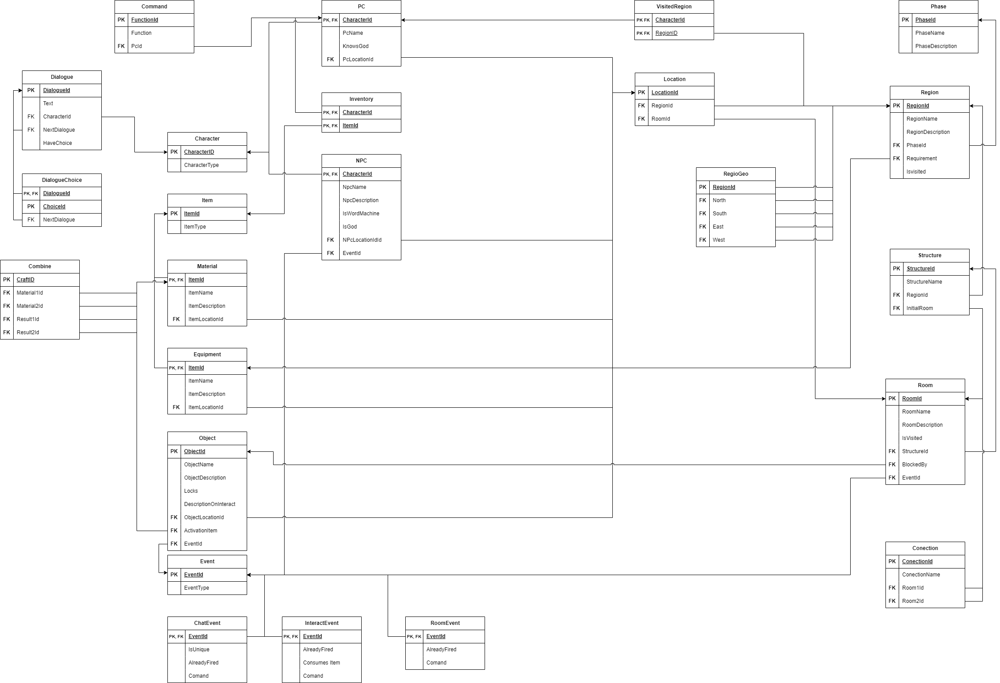

# <a>Modelo Lógico</a>

## <a>Introdução</a>
O modelo lógico é uma representação abstrata de um banco de dados que descreve a estrutura dos dados e as relações entre eles. Ele é independente do banco de dados físico que detalha como os dados serão implementados. 

O modelo lógico serve como um modelo para os dados usados e leva os elementos de modelagem de dados conceituais um passo adiante, adicionando mais informações a eles. 

O modelo lógico incorpora todos os elementos de informação que são vitais para o funcionamento do dia a dia dos negócios. Um projeto lógico é a implementação do modelo lógico em um banco de dados real. 

Ele descreve como os dados serão armazenados e organizados em tabelas, colunas e chaves primárias e estrangeiras. O projeto lógico é baseado no modelo lógico e é usado para criar um banco de dados físico que possa ser usado para armazenar e recuperar dados

## <a>Modelo Relacional</a>
O modelo relacional usa uma coleção de tabelas para representar tanto os dados quanto as relações entre esses dados. Cada tabela tem várias colunas, e cada coluna tem um nome exclusivo. As tabelas também são conhecidas como relações. 

O modelo relacional é um exemplo de modelo baseado em registro. Os modelos baseados em registro são assim chamados porque o banco de dados é estruturado em registros de vários tipos com formato fixo. 

Cada tabela contém registros de um tipo específico. Cada tipo de registro define um número fixo de campos ou atributos. As colunas da tabela correspondem aos atributos do tipo de registro. O modelo de dados relacional é o modelo de dados mais amplamente utilizado, e a grande maioria dos sistemas de banco de dados atuais é baseada no modelo relacional. ¹

### <a>Dependências Funcionais</a>
As dependências funcionais são uma parte importante do modelo relacional. Uma dependência funcional é uma relação entre dois atributos de uma tabela, onde um atributo determina o valor de outro. Em outras palavras, se o valor de um atributo A determina o valor de um atributo B, então dizemos que B é funcionalmente dependente de A.

 As dependências funcionais são usadas para garantir que os dados em uma tabela sejam consistentes e precisos. Elas também são usadas para ajudar a normalizar as tabelas, o que pode melhorar o desempenho do banco de dados e reduzir a redundância de dados.

### <a>Normalização</a>
A normalização é um processo importante na modelagem relacional. Ela é usada para garantir que os dados em uma tabela sejam consistentes e precisos, além de ajudar a reduzir a redundância de dados e melhorar o desempenho do banco de dados. 

A normalização é baseada em dependências funcionais, que são relações entre dois atributos de uma tabela, onde um atributo determina o valor de outro. A normalização é dividida em várias formas normais, cada uma com um conjunto de regras que devem ser seguidas para garantir que a tabela esteja normalizada. 

As formas normais mais comuns são a primeira forma normal (1NF), a segunda forma normal (2NF) e a terceira forma normal (3NF). Há também as formas normais mais avançadas como a quarta forma normal (4NF) e a forma normal de Boyce-Codd (FNBC). Cada forma normal tem um conjunto de regras que devem ser seguidas para garantir que a tabela esteja normalizada. 

### <a>Dicionario de Dados</a>
O dicionário de dados é uma ferramenta importante na modelagem de banco de dados relacionais. Ele contém informações detalhadas sobre as tabelas, colunas, tipos de dados, restrições e outras informações relevantes para o banco de dados. 

O dicionário de dados é usado para documentar o modelo de dados e garantir que todos os desenvolvedores e usuários do banco de dados tenham uma compreensão clara dos dados armazenados e como eles são organizados. Ele também pode ser usado para ajudar a garantir a integridade dos dados e a consistência do modelo de dados.

<strong>Dicionario de Dados</strong>

<table>
    <tr>
        <th style="text-align:center">Tabela</th>
        <td style="text-align:center" colspan="4">Characters</td>
    </tr>
    <tr>
        <th style="text-align:center">Descrição</th>
        <td style="text-align:center" colspan="4">texto</td>
    </tr>
    <tr>
        <th style="text-align:center">Observações</th>
        <td style="text-align:center" colspan="4">texto</td>
    </tr>
    <tr>
        <th style="text-align:center" colspan="5">Campos</th>
    </tr>
    <tr>
        <th style="text-align:center">Nome</th>
        <th style="text-align:center">Descrição</th>
        <th style="text-align:center">Tipo de Dado</th>
        <th style="text-align:center">Tamanho</th>
        <th style="text-align:center">Restrições de Dominio</th>
    </tr>
</table>

### <a>Diagrama do Esquema Relacional</a>
O esquema relacional é a representação do modelo de dados relacional em forma de diagrama, que mostra as tabelas, seus atributos e as relações entre elas. 

O esquema relacional é uma ferramenta importante na modelagem de banco de dados, pois ajuda a visualizar a estrutura do banco de dados e a identificar as relações entre as tabelas.
 

 
**Figura 1** : Diagrama Entidade Relacionamento

 
Clique [aqui](../../images/modelagem/Esquema-Relacional-1.0.png) para ver a imagem em tela cheia. 
Ou clique [aqui](../../arquivos/Esquema-Relacional-1.0.drawio) para baixar o arquivo do draw.io.

## <a>Histórico de Versão</a>

|   Data   | Versão |      Descrição       |                   Autor                    |
| :------: | :----: | :------------------: | :----------------------------------------: |
| 25/11/23 |  1.0   | Criação do documento | [João Lucas](https://github.com/HacKairos) |

## <a>Bilbiografia</a>
    AVI SILBERSCHATZ, HENRY F. KORTH, S. SUDARSHAN. Database System Concepts. [s.l: s.n.].